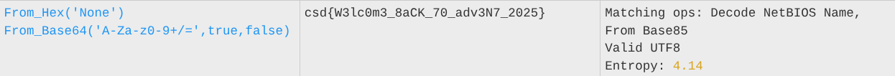

# The Mission Begins
### Cryptography

# Solution:

We get a `start.txt` which contains the following:
```
00110101 00111001 00110011 00110011 00110100 01100101 00110110 01100010 00110110 00110101 00110011 00110001 00110110 00110011 00110111 01100001 00110110 00110010 00110100 00110111 00110100 01100100 00110111 00110111 00110110 00110010 00110101 00110100 00110100 01100101 00110110 00110110 00110100 01100110 00110100 00110111 00110100 00110110 00110100 00110100 00110101 00110011 00110011 00110001 00110011 00111000 00110011 00110011 00110100 01100100 00110100 00110110 00110011 00111001 00110110 00111000 00110101 01100001 00110100 00111000 00110101 00111001 00110111 01100001 00110101 00110100 00110110 01100001 00110110 00110100 00110110 00110110 00110100 01100100 00110110 01100001 00110100 00110001 00110111 00111001 00110100 01100101 00110101 00111000 00110011 00110000 00110011 01100100
```
So, obviously, this is binary data, and since there's 8 bits for every segment, we can assume that they are individual bytes. I wrote this script to convert them back:
```python
file = open("start.txt")
data = file.read().split(" ")
for index, byte in enumerate(data):
    data[index] = int(byte, 2)
    print(chr(data[index]), end="")
```
which now gives me:
```
59334e6b6531637a62474d7762544e664f474644533138334d4639685a48597a546a64664d6a41794e58303d
```

Putting this in CyberChef, and selecting the `magic` recipe (The **Magic** operation attempts to detect various properties of the input data and suggests which operations could help to make more sense of it), we get:

This shows that we are interpreting the string as hex bytes, which returns a base64 string which we then decode.

# Flag:
```
csd{W3lc0m3_8aCK_70_adv3N7_2025}
```
