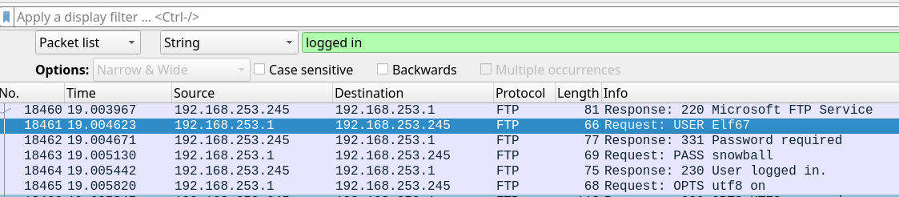

# The First Strike
### Forensics

# Solution:
Opening the `pcap` file in Wireshark, we see a whole bunch of login attempts on various users, which looks like a bruteforce using wordlist. The description asks me to find which account was compromised and to find the password for that account. I switched the filter type to String and searched for various phrases which might be sent for a successful login, such as `success` and `logged in`. The latter worked, which showed me the following login attempt:


# Flag:
```
csd{Elf67_snowball}
```
