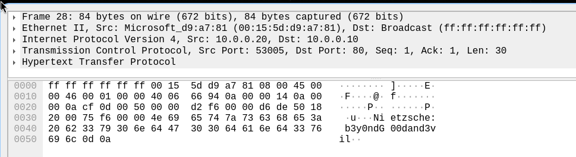

# 1. Hide and Seek

> Description:
  Sakamoto’s at it again with a game of hide and seek, but this time, it’s not with Shin or his daughter. An old friend hid some secret data in this image. Can you find it before the others do?
  Hint: Even in retirement, Sakamoto never loses at hide and seek. Maybe stegseek can help you keep up.

## Solution:

Typical steganography problem. Since there was no obvious passphrase, I just used the rockyou.txt wordlist.

```
stegseek sakamoto.jpg /home/gaurav/rockyou.txt 
StegSeek 0.6 - https://github.com/RickdeJager/StegSeek

[i] Found passphrase: "iloveyou1"
[i] Original filename: "flag.txt".
[i] Extracting to "sakamoto.jpg.out".
```

Upon reading the file `sakamoto.jpg.out`, we get:

## Flag:

```
nite{h1d3_4nd_s33k_but_w1th_st3g_sdfu9s8}
```

## Concepts learnt:

- Steganography, wordlists

***

# 2. Nutrela Chunks

> One of my favorite foods is soya chunks. But as I was enjoying some Nutrela today, I noticed a few chunks weren’t quite right. Seems like something’s off with their structure. Could you help me fix these broken chunks so I can enjoy my meal again?

## Solution:

From the description, we can see that this is obviously a case of editing the header bytes of the file to fix the format and let image readers display it properly.
From online sources, a PNG header has the following sections:
- Every PNG starts with `89 50 4E 47 0D 0A 1A 0A`
- IHDR Chunk
- IDAT Chunk
- IEND Chunk (present at the end)

I noticed the starting magic bytes were in lower case. same with all of the chunk names. Changing them to uppercase gave me the flag:

## Flag:

```
nite{n0w_y0u_kn0w_ab0ut_PNG_chunk5}
```

***

# 3. RAR of the Abyss

> Two philosophers peer into the networked abyss and swap a secret. Use the secret to decrypt the Abyss’ RAwR and pull your flag from the void.

## Solution:

Looking at the description, it's obvious that we have to find a rar file and the password used to encrypt it. Opening the pcap file in Wirehsark, we see two packets of interest:

and:

The first shows something interesting, we have Rar! printed in ascii. This led me to believe that that was the magic bytes of a rar file, so I extracted the bytes as a C-style array and made the script to write it to a file:
```python
data = [0x52, 0x61, 0x72, 0x21, 0x1a, 0x7, 0x1, 0x0, 0x94, 0xce, 0xed, 0xc1, 0x21, 0x4, 0x0, 0x0, 0x1, 0xf, 0x64, 0x45, 0x37, 0xb9, 0x27, 0x8a, 0x61, 0xe2, 0x55, 0x3, 0xb4, 0x95, 0x75, 0x6, 0xe3, 0x67, 0x43, 0x91, 0xaa, 0x7, 0x66, 0xe8, 0x43, 0xdc, 0xa3, 0xd7, 0x5f, 0x52, 0xdc, 0x8, 0xf7, 0x77, 0x4f, 0x64, 0x70, 0xa0, 0xa3, 0x26, 0x80, 0xcc, 0xd6, 0x6b, 0x61, 0x2a, 0xe4, 0x73, 0x47, 0xd8, 0xe, 0x85, 0xf7, 0xa2, 0xd1, 0x90, 0x71, 0x78, 0x72, 0x8f, 0xa6, 0x5d, 0xe0, 0x5f, 0xe2, 0xec, 0x15, 0x8a, 0x6f, 0xb4, 0xb, 0xe1, 0x96, 0xb2, 0xfe, 0x5b, 0x2a, 0xbb, 0xe7, 0xf1, 0x56, 0x8c, 0x44, 0x50, 0x80, 0xa8, 0x6b, 0x1b, 0x49, 0xee, 0xbe, 0x54, 0xef, 0x77, 0x7e, 0x18, 0x86, 0xc7, 0x96, 0xfa, 0xba, 0xfd, 0x16, 0xe5, 0x1b, 0xaa, 0xa4, 0x31, 0xb1, 0xc0, 0xed, 0x3a, 0x6f, 0x3a, 0x7, 0x0, 0xa6, 0xc3, 0x4b, 0x4f, 0x64, 0xea, 0x71, 0x3, 0xe9, 0x39, 0xaf, 0xf7, 0xa9, 0x5a, 0x9e, 0x9b, 0x2e, 0xa0, 0xb8, 0x7c, 0xbc, 0x18, 0x61, 0x59, 0xa2, 0x52, 0xd0, 0x4, 0x8f, 0x5b, 0x1d, 0xa8, 0x71, 0x38, 0x7f, 0x8f, 0x93, 0xf, 0xbd, 0xe3, 0x7d, 0xf8, 0xdd, 0x1e, 0x41, 0xa8, 0x21, 0x5c, 0x0, 0xb0, 0x45, 0xe5, 0x9f, 0x37, 0x4c, 0x21, 0xe6, 0x7c, 0x9f, 0x1d, 0xd0, 0x2f, 0xb9, 0x83, 0xee, 0x10, 0x17, 0x84, 0xfa, 0xda, 0xa9, 0x29, 0x29, 0xed, 0x7b, 0x6a, 0x61, 0xc4, 0xda, 0x9d, 0x9f, 0xfa, 0x74, 0x87, 0xf7, 0xe6, 0x85, 0x3d, 0xad, 0xd1, 0xeb, 0xf4, 0xb, 0x19, 0x98, 0xb7, 0x16, 0xf0, 0xab, 0x41, 0xd1, 0x9d, 0x1b, 0x6a, 0x25, 0x0, 0xc, 0x58, 0xc2, 0xfc, 0x96, 0xf9, 0xb0, 0xc4, 0xcd, 0xcf, 0xa7, 0xee, 0x79, 0xb2, 0xef, 0x92, 0x6b, 0x5, 0x1d, 0xff, 0x71, 0x32, 0xa4, 0xc4, 0xa3, 0xf8, 0x4b, 0x75, 0xdb, 0xd9, 0x76, 0xb, 0x67, 0xfb, 0xa3, 0xcb, 0x5c, 0x79, 0x7b, 0xd7, 0xbd, 0xf1, 0xd7, 0xde, 0x52, 0xa9, 0x4a, 0x7f]


file = open("file.rar", "wb")
file.write(bytes(data))
```

The second shows that the password is: `b3y0ndG00dand3vil`
Extracting the rar file using `7z x file.rar`, it prompts for the password and upon entering we get `flag.txt`. This contains the flag:
## Flag:

```
nite{thus_sp0k3_th3_n3tw0rk_f0r3ns1cs_4n4lyst}
```

***
