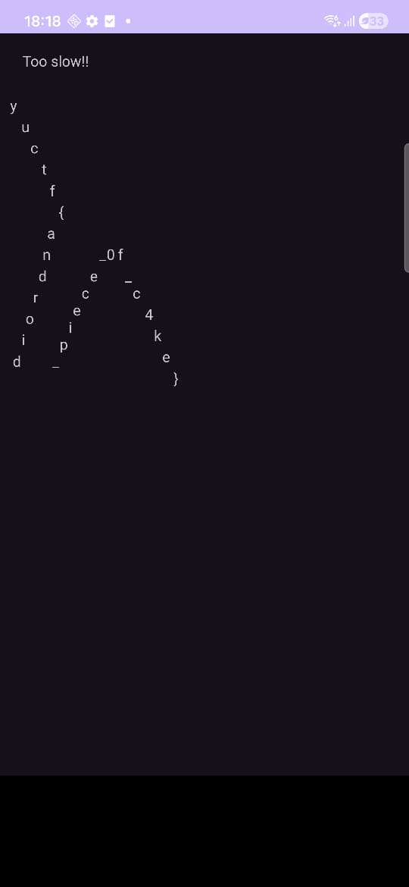

# 1. JoyDivision

## Solution:

Using IDA free, I disassembled the binary and decompiled it. Here are the relevant functions:
```c
int __fastcall main(int argc, const char **argv, const char **envp)
{
  unsigned __int64 len_plus_15; // rax
  void *v4; // rsp
  char v6[8]; // [rsp+8h] [rbp-80h] BYREF
  int i; // [rsp+10h] [rbp-78h]
  int length; // [rsp+14h] [rbp-74h]
  FILE *stream; // [rsp+18h] [rbp-70h]
  __int64 len_minus_one; // [rsp+20h] [rbp-68h]
  char *s; // [rsp+28h] [rbp-60h]
  __int64 v12; // [rsp+30h] [rbp-58h]
  __int64 v13; // [rsp+38h] [rbp-50h]
  void *ptr; // [rsp+40h] [rbp-48h]
  FILE *v15; // [rsp+48h] [rbp-40h]
  unsigned __int64 v16; // [rsp+50h] [rbp-38h]

  v16 = __readfsqword(0x28u);
  puts("\nMay Jupiter strike you down Caeser before you seize the treasury!! You will have to tear me apart");
  puts("for me to tell you the flag to unlock the Roman Treasury and fund your civil war. I, Lucius Caecilius");
  puts("Metellus, shall not let you pass until you get this password right. (or threaten to kill me-)\n");
  stream = fopen("palatinepackflag.txt", "r");
  fseek(stream, 0LL, 2);
  length = ftell(stream) + 1;
  fseek(stream, 0LL, 0);
  len_minus_one = length - 1LL;
  len_plus_15 = 16 * ((length + 15LL) / 0x10uLL);
  while ( v6 != &v6[-(len_plus_15 & 0xFFFFFFFFFFFFF000LL)] )
    ;
  v4 = alloca(len_plus_15 & 0xFFF);
  if ( (len_plus_15 & 0xFFF) != 0 )
    *(_QWORD *)&v6[(len_plus_15 & 0xFFF) - 8] = *(_QWORD *)&v6[(len_plus_15 & 0xFFF) - 8];
  s = v6;
  fgets(v6, length, stream);
  flipBits(s, (unsigned int)length);
  v12 = expand(s, (unsigned int)length);
  v13 = expand(v12, (unsigned int)(2 * length));
  ptr = (void *)expand(v13, (unsigned int)(4 * length));
  anti_debug();
  for ( i = 0; i < 8 * length; ++i )
    putchar(*((unsigned __int8 *)ptr + i));
  putchar(10);
  v15 = fopen("flag.txt", "wb");
  fwrite(ptr, 1uLL, 8 * length, v15);
  fclose(v15);
  return 0;
}
```

```c
__int64 __fastcall flipBits(__int64 a1, int a2)
{
  __int64 result; // rax
  char v3; // [rsp+13h] [rbp-9h]
  _BOOL4 v4; // [rsp+14h] [rbp-8h]
  unsigned int i; // [rsp+18h] [rbp-4h]

  v4 = 0;
  v3 = 105;
  for ( i = 0; ; ++i )
  {
    result = i;
    if ( (int)i >= a2 )
      break;
    if ( v4 )
    {
      *(_BYTE *)((int)i + a1) ^= v3;
      v3 += 32;
    }
    else
    {
      *(_BYTE *)((int)i + a1) = ~*(_BYTE *)((int)i + a1);
    }
    v4 = !v4;
  }
  return result;
}

```

```c
_BYTE *__fastcall expand(__int64 a1, int a2)
{
  unsigned __int8 v3; // [rsp+1Bh] [rbp-15h]
  _BOOL4 v4; // [rsp+1Ch] [rbp-14h]
  int i; // [rsp+20h] [rbp-10h]
  _BYTE *v6; // [rsp+28h] [rbp-8h]

  v4 = 0;
  v3 = 105;
  v6 = malloc(2 * a2);
  for ( i = 0; i < a2; ++i )
  {
    if ( v4 )
    {
      v6[2 * i] = (v3 >> 4) | *(_BYTE *)(i + a1) & 0xF0;
      v6[2 * i + 1] = (16 * v3) | *(_BYTE *)(i + a1) & 0xF;
    }
    else
    {
      v6[2 * i] = (16 * v3) | *(_BYTE *)(i + a1) & 0xF;
      v6[2 * i + 1] = (v3 >> 4) | *(_BYTE *)(i + a1) & 0xF0;
    }
    v3 *= 11;
    v4 = !v4;
  }
  printf("fie");
  return v6;
}

```

```c
void anti_debug()
{
    if (ptrace(0, 0, 1, 0) != -1)
        return;
    puts("THOU SHALL NOT READ MY MIND WITH GOTHIC MAGIC CAESER!!!\n");
    exit(1); /* do not return */
}
```


Following the logic, I made this program to decompile it:
```python
flag_file = open("flag.txt", "rb")
flag = flag_file.read()
flag = bytearray(flag)

def de_expand(arr):
    og_arr = bytearray(len(arr) // 2)
    v3 = 105
    v4 = False
    
    for i in range(len(og_arr)):
        byte1 = arr[2 * i]
        byte2 = arr[2 * i + 1]
        
        if v4:
            og_arr[i] = (byte1 & 0xF0) | (byte2 & 0x0F)
        else:
            og_arr[i] = (byte1 & 0x0F) | (byte2 & 0xF0)
        
        v3 = (v3 * 11) % 256 
        # Lost a lot of hair before figuring out v3 was an 8bit/1 byte integer in the decompiled C code. fml.
        v4 = not v4
    
    return og_arr

def de_flipbits(arr):
    v4 = False
    v3 = 105;
    
    for i in range(len(arr)):
        if v4:
            arr[i] = arr[i] ^ v3
            v3 = (v3 + 32 ) % 256
        else:
            arr[i] = (~arr[i]) & 0xFF 
            # this & 0xFF bullshit is fucking stupid fuck python
        v4 = not v4

    return arr

del flag[len(flag) - 1]
v13 = de_expand(flag)
v12 = de_expand(v13)
s = de_expand(v12)
s = de_flipbits(s)

print(s)
print(s.decode())
```

Few points of interest:
- in `de_expand`, v3 is an unsigned 8bit integer, but python uses infinite precision, so to simulate integer overflow we have to `% 256`.
- again, because be are using Python which has infinite precision, we have to `& 0xFF` in `de_flipbits` to disregard the sign bit.

## Flag:

```
sunshine{C3A5ER_CR055ED_TH3_RUB1C0N}
```

## Concepts learnt:

- Reinforced existing concepts and the process of reverse engineering.
- Learnt about how stack memory management works, how the kernel allocates memory in 4kb chunks, and how the compiler inserts code to page each of those chunks before any of it used.

## Notes:

- A lot of time was sent on figuring out which parts of the decompiled code were the actual logic from the original code, and which parts were inserted by the compiler for memory management.


***

# 2. worthy.knight

## Solution:

The first think I did was look up what a .knight extension is, which came back to be the encrypted output of the Knight ransomware. Seeing as how no way of decrypting it without a key exists, I disregarded this fact.

Decompiling it, here are the relevant functions:
```c

undefined4 FUN_001010d0(void)

{
   byte bVar1;
   int iVar2;
   char *null_check;
   size_t length;
   ushort **ppuVar3;
   byte *input_copy;
   undefined4 uVar4;
   char *pcVar5;
   long in_FS_OFFSET;
   ushort local_10c;
   undefined1 local_10a;
   byte local_108 [16];
   char local_f8 [32];
   char local_d8 [16];
   undefined1 input [16];
   undefined1 local_b8 [16];
   undefined1 local_a8 [16];
   undefined1 local_98 [16];
   undefined1 local_88 [16];
   undefined1 local_78 [16];
   undefined1 local_68 [16];
   undefined1 local_58 [16];
   long local_40;
   ushort input0;
   ushort input1;
   
   local_40 = *(long *)(in_FS_OFFSET + 0x28);
   puts(
         "                       (Knight\'s Adventure)                \n\n         O                                              \n        <M>            .---.                            \n        /W\\           ( -.- )--------.                  \n   ^    \\|/            \\_o_/         )    ^             \n  /|\\    |     *      ~~~~~~~       /    /|\\            \n  / \\   / \\  / |\\                    /    / \\            \n~~~~~~~~~~~~~~~~~~~~~~~~~~~~~~~~~~~~~~~~~~~~~~~~ ~~~~~~~~~\nWelcome, traveler. A mighty dragon blocks the gate.\nSpeak the secret incantation ( 10 runic letters) to continue.\n"
         );
   input = (undefined1  [16])0x0;
   local_b8 = (undefined1  [16])0x0;
   local_a8 = (undefined1  [16])0x0;
   local_98 = (undefined1  [16])0x0;
   local_88 = (undefined1  [16])0x0;
   local_78 = (undefined1  [16])0x0;
   local_68 = (undefined1  [16])0x0;
   local_58 = (undefined1  [16])0x0;
   printf("Enter your incantation: ");
   null_check = fgets(input,0x80,stdin);
   if (null_check == (char *)0x0) {
      puts("\nSomething went awry. Fare thee well...");
   }
   else {
      length = strcspn(input,"\n");
      input[length] = 0;
      length = strlen(input);
      if (length == 10) {
         ppuVar3 = __ctype_b_loc();
         input_copy = input;
         do {
            input0 = (*ppuVar3)[*input_copy];
            if (((input0 & 0x400) == 0) || (input1 = (*ppuVar3)[input_copy[1]], (input1 & 0x400) == 0))
            {
               puts("\nThe runes fail to align. The incantation is impure.");
               puts(&DAT_001022b8);
               goto LAB_0010124c;
            }
            if ((((input0 & 0x100) != 0) && ((input1 & 0x100) != 0)) ||
                 (((input0 & 0x200) != 0 && ((input1 & 0x200) != 0)))) {
               puts("\nThe ancient seals do not resonate with your runes.");
               puts(&DAT_001022b8);
               goto LAB_0010124c;
            }
            input_copy = input_copy + 2;
         } while (input_copy != input + 10);
         if ((byte)(input[1] ^ input[0]) == 0x24) {
            if (input[1] == 0x6a) {
               if ((input[2] ^ input[3]) == 0x38) {
                  if (input[3] == 0x53) {
                      local_10a = 0;
                      input_copy = local_108;
                      local_10c = input._4_2_ << 8 | (ushort)input._4_2_ >> 8;
                      length = strlen((char *)&local_10c);
                      MD5((uchar *)&local_10c,length,input_copy);
                      null_check = local_f8;
                      do {
                         bVar1 = *input_copy;
                         pcVar5 = null_check + 2;
                         input_copy = input_copy + 1;
                         sprintf(null_check,"%02x",(ulong)bVar1);
                         null_check = pcVar5;
                      } while (local_d8 != pcVar5);
                      local_d8[0] = '\0';
                      iVar2 = strcmp(local_f8,"33a3192ba92b5a4803c9a9ed70ea5a9c");
                      if (iVar2 == 0) {
                         if ((input[6] ^ input[7]) == 0x38) {
                            if (input[7] == 0x61) {
                               if ((byte)(input[9] ^ input[8]) == 0x20) {
                                  if (input[9] == 0x69) {
                                     printf("\n%s\n",
                                                "   The kingdom\'s gates open, revealing the hidden realm...    \n                         ( (                                 \n                          \\ \\                                \n                     .--.  ) ) .--.                         \n                    (    )/_/ (    )                        \n                     \'--\'       \'--\'                         \n    \"Huzzah! Thy incantation is true. Onward, brave knight!\" \n"
                                               );
                                     printf("The final scroll reveals your reward: KCTF{%s}\n\n",input);
                                     uVar4 = 0;
                                     goto LAB_00101251;
                                  }
                                  puts("\nThe wards reject your Pair 5 second char.");
                                  puts(&DAT_001022b8);
                               }
                               else {
                                  puts("\nThe wards reject your Pair 5.");
                                  puts(&DAT_001022b8);
                               }
                            }
                            else {
                               puts("\nThe wards reject your Pair 4 second char.");
                               puts(&DAT_001022b8);
                            }
                         }
                         else {
                            puts("\nThe wards reject your Pair 4.");
                            puts(&DAT_001022b8);
                         }
                      }
                      else {
                         puts("\nThe dragon\'s eyes glow red... The final seal remains locked.");
                         puts(&DAT_001022b8);
                      }
                  }
                  else {
                      puts("\nThe wards reject your Pair 2 second char.");
                      puts(&DAT_001022b8);
                  }
               }
               else {
                  puts("\nThe wards reject your Pair 2.");
                  puts(&DAT_001022b8);
               }
            }
            else {
               puts("\nThe wards reject your Pair 1 second char.");
               puts(&DAT_001022b8);
            }
         }
         else {
            puts("\nThe wards reject your Pair 1.");
            puts(&DAT_001022b8);
         }
      }
      else {
         puts("\nScribe\'s note: The incantation must be exactly 10 runic symbols.");
         puts(&DAT_001022b8);
      }
   }
LAB_0010124c:
   uVar4 = 1;
LAB_00101251:
   if (local_40 == *(long *)(in_FS_OFFSET + 0x28)) {
      return uVar4;
   }
                               /* WARNING: Subroutine does not return */
   __stack_chk_fail();
}
```

This was an interesting solve, requiring multiple separate programs. I have also renamed some of the variables in Ghidra (I got sick of IDA) to make it more readable based on the logic.

This program seems to take in user input, and checks each pair of character with a whole bunch of rules. the first rule is that the user input must be 10 characters long.

The program is using <ctype.h> which has a lookup table for each character with an integer, where each bit is a result of functions like `isDigit()`, `isAlpha()`, `isPunctuation()`. We then perform `&` operation on that integer to get each bit result. Looking at `/usr/include/ctype.h`:
```c
#ifndef _ISbit
/* These are all the characteristics of characters.
   If there get to be more than 16 distinct characteristics,
   many things must be changed that use `unsigned short int's.

   The characteristics are stored always in network byte order (big
   endian).  We define the bit value interpretations here dependent on the
   machine's byte order.  */

# include <bits/endian.h>
# if __BYTE_ORDER == __BIG_ENDIAN
#  define _ISbit(bit)	(1 << (bit))
# else /* __BYTE_ORDER == __LITTLE_ENDIAN */
#  define _ISbit(bit)	((bit) < 8 ? ((1 << (bit)) << 8) : ((1 << (bit)) >> 8))
# endif

enum
{
  _ISupper = _ISbit (0),	/* UPPERCASE.  */
  _ISlower = _ISbit (1),	/* lowercase.  */
  _ISalpha = _ISbit (2),	/* Alphabetic.  */
  _ISdigit = _ISbit (3),	/* Numeric.  */
  _ISxdigit = _ISbit (4),	/* Hexadecimal numeric.  */
  _ISspace = _ISbit (5),	/* Whitespace.  */
  _ISprint = _ISbit (6),	/* Printing.  */
  _ISgraph = _ISbit (7),	/* Graphical.  */
  _ISblank = _ISbit (8),	/* Blank (usually SPC and TAB).  */
  _IScntrl = _ISbit (9),	/* Control character.  */
  _ISpunct = _ISbit (10),	/* Punctuation.  */
  _ISalnum = _ISbit (11)	/* Alphanumeric.  */
};
#endif /* ! _ISbit  */
```

from this we can see which function corresponds to which mask value for the `&` operation.

From this line:
`if (((input0 & 0x400) == 0) || (input1 = (*ppuVar3)[input_copy[1]], (input1 & 0x400) == 0))`, this line checks if every character is an alphabet
this line, `if ((((input0 & 0x100) != 0) && ((input1 & 0x100) != 0)) || (((input0 & 0x200) != 0 && ((input1 & 0x200) != 0))))` checks if each pair of characters is of opposite case.

If we pass these two rules, we move on to the individual character testing:
`if ((byte)(input[1] ^ input[0]) == 0x24)`, this line says the XOR of the bits of the 1st and second character must be 0x24. To find pairs of such characters, I made this script:
```python
mask = int(input("Enter mask integer: "), 16)

for i in range(65, 91):
    char1 = chr(i)
    for j in range(97, 123):
        char2 = chr(j)
        if i ^ j == mask:
            print(f"char1: {char1}\nchar2: {char2}")
    print("======")
```
I won't include the output for the sake of brevity, but this gives me each character pair that satisfies the XOR condition.
We see from this line that `if (input[1] == 0x6a)`, the second character must correspond to the ASCII value of `106`, which is `j`. Looking at the output of pairfinder.py, we can find the corresponding character.

Repeating this for all the other characters (except for 5 and 6), we get the following input phrase:
`NjkS__YaIi`, where `__` can be any character. In the decompiled code, they are performing some bit operations then taking the MD5 hash of the output and comparing it. Being completely honest, I don't feel like following those operations, so I decided to bruteforce it, since its only 2 characters. I made a script to do so:
```python
import subprocess

alpha = "abcdefghijklmnopqrstuvwxyz"

for upper in alpha.upper():
    for lower in alpha:
        result = subprocess.run(["./worthy.knight"], input=f"NjkS{lower}{upper}YaIi", capture_output=True, text=True)
        if "KCTF" in result.stdout.upper():
            print(f"NjkS{lower}{upper}YaIi")
            exit()
```

Running this we get the flag.

## Flag:

```
KCTF{NjkSfTYaIi}
```

***
# 3. time
## Solution:

Since we are using a random number generator, we can't really find the flag using just decompilation since the number is being generated at runtime. Therefore we use a debugger:
```c
gdb ./time
GNU gdb (GDB) 16.3
Copyright (C) 2024 Free Software Foundation, Inc.
License GPLv3+: GNU GPL version 3 or later <http://gnu.org/licenses/gpl.html>
This is free software: you are free to change and redistribute it.
There is NO WARRANTY, to the extent permitted by law.
Type "show copying" and "show warranty" for details.
This GDB was configured as "x86_64-pc-linux-gnu".
Type "show configuration" for configuration details.
For bug reporting instructions, please see:
<https://www.gnu.org/software/gdb/bugs/>.
Find the GDB manual and other documentation resources online at:
    <http://www.gnu.org/software/gdb/documentation/>.

For help, type "help".
Type "apropos word" to search for commands related to "word"...
Reading symbols from ./time...

This GDB supports auto-downloading debuginfo from the following URLs:
  <https://debuginfod.archlinux.org>
Enable debuginfod for this session? (y or [n]) y
Debuginfod has been enabled.
To make this setting permanent, add 'set debuginfod enabled on' to .gdbinit.
(No debugging symbols found in ./time)
(gdb) start
Temporary breakpoint 1 at 0x40092f
Starting program: /home/gaurav/Projects/gaurav_phase2/custom_challenges/RevEngg/time/time 
[Thread debugging using libthread_db enabled]
Using host libthread_db library "/usr/lib/libthread_db.so.1".

Temporary breakpoint 1, 0x000000000040092f in main ()
(gdb) disas
Dump of assembler code for function main:
   0x000000000040092b <+0>:	push   %rbp
   0x000000000040092c <+1>:	mov    %rsp,%rbp
=> 0x000000000040092f <+4>:	sub    $0x20,%rsp
   0x0000000000400933 <+8>:	mov    %edi,-0x14(%rbp)
   0x0000000000400936 <+11>:	mov    %rsi,-0x20(%rbp)
   0x000000000040093a <+15>:	mov    %fs:0x28,%rax
   0x0000000000400943 <+24>:	mov    %rax,-0x8(%rbp)
   0x0000000000400947 <+28>:	xor    %eax,%eax
   0x0000000000400949 <+30>:	mov    $0x0,%edi
   0x000000000040094e <+35>:	call   0x400750 <time@plt>
   0x0000000000400953 <+40>:	mov    %eax,%edi
   0x0000000000400955 <+42>:	call   0x400730 <srand@plt>
   0x000000000040095a <+47>:	call   0x400790 <rand@plt>
   0x000000000040095f <+52>:	mov    %eax,-0xc(%rbp)
   0x0000000000400962 <+55>:	lea    0x1c7(%rip),%rdi        # 0x400b30
   0x0000000000400969 <+62>:	call   0x4006e0 <puts@plt>
   0x000000000040096e <+67>:	lea    0x1e3(%rip),%rdi        # 0x400b58
   0x0000000000400975 <+74>:	call   0x4006e0 <puts@plt>
   0x000000000040097a <+79>:	lea    0x207(%rip),%rdi        # 0x400b88
   0x0000000000400981 <+86>:	call   0x4006e0 <puts@plt>
   0x0000000000400986 <+91>:	lea    0x21b(%rip),%rdi        # 0x400ba8
   0x000000000040098d <+98>:	mov    $0x0,%eax
   0x0000000000400992 <+103>:	call   0x400710 <printf@plt>
   0x0000000000400997 <+108>:	mov    0x2006ea(%rip),%rax        # 0x601088 <stdout@@GLIBC_2.2.5>
   0x000000000040099e <+115>:	mov    %rax,%rdi
   0x00000000004009a1 <+118>:	call   0x400760 <fflush@plt>
   0x00000000004009a6 <+123>:	lea    -0x10(%rbp),%rax
   0x00000000004009aa <+127>:	mov    %rax,%rsi
   0x00000000004009ad <+130>:	lea    0x208(%rip),%rdi        # 0x400bbc
   0x00000000004009b4 <+137>:	mov    $0x0,%eax
   0x00000000004009b9 <+142>:	call   0x400780 <__isoc99_scanf@plt>
   0x00000000004009be <+147>:	mov    -0x10(%rbp),%eax
   0x00000000004009c1 <+150>:	mov    %eax,%esi
   0x00000000004009c3 <+152>:	lea    0x1f5(%rip),%rdi        # 0x400bbf
   0x00000000004009ca <+159>:	mov    $0x0,%eax
   0x00000000004009cf <+164>:	call   0x400710 <printf@plt>
   0x00000000004009d4 <+169>:	mov    -0xc(%rbp),%eax
   0x00000000004009d7 <+172>:	mov    %eax,%esi
   0x00000000004009d9 <+174>:	lea    0x1f3(%rip),%rdi        # 0x400bd3
   0x00000000004009e0 <+181>:	mov    $0x0,%eax
   0x00000000004009e5 <+186>:	call   0x400710 <printf@plt>
   0x00000000004009ea <+191>:	mov    0x200697(%rip),%rax        # 0x601088 <stdout@@GLIBC_2.2.5>
   0x00000000004009f1 <+198>:	mov    %rax,%rdi
   0x00000000004009f4 <+201>:	call   0x400760 <fflush@plt>
   0x00000000004009f9 <+206>:	mov    -0x10(%rbp),%eax
   0x00000000004009fc <+209>:	cmp    %eax,-0xc(%rbp)
   0x00000000004009ff <+212>:	jne    0x400a14 <main+233>
   0x0000000000400a01 <+214>:	lea    0x1e0(%rip),%rdi        # 0x400be8
--Type <RET> for more, q to quit, c to continue without paging--
   0x0000000000400a08 <+221>:	call   0x4006e0 <puts@plt>
   0x0000000000400a0d <+226>:	call   0x400877 <giveFlag>
   0x0000000000400a12 <+231>:	jmp    0x400a20 <main+245>
   0x0000000000400a14 <+233>:	lea    0x1fd(%rip),%rdi        # 0x400c18
   0x0000000000400a1b <+240>:	call   0x4006e0 <puts@plt>
   0x0000000000400a20 <+245>:	mov    0x200661(%rip),%rax        # 0x601088 <stdout@@GLIBC_2.2.5>
   0x0000000000400a27 <+252>:	mov    %rax,%rdi
   0x0000000000400a2a <+255>:	call   0x400760 <fflush@plt>
   0x0000000000400a2f <+260>:	mov    $0x0,%eax
   0x0000000000400a34 <+265>:	mov    -0x8(%rbp),%rdx
   0x0000000000400a38 <+269>:	xor    %fs:0x28,%rdx
   0x0000000000400a41 <+278>:	je     0x400a48 <main+285>
   0x0000000000400a43 <+280>:	call   0x400700 <__stack_chk_fail@plt>
   0x0000000000400a48 <+285>:	leave
   0x0000000000400a49 <+286>:	ret
End of assembler dump.
(gdb) br 0x0000000000400962
Function "0x0000000000400962" not defined.
Make breakpoint pending on future shared library load? (y or [n]) n
(gdb) br *0x0000000000400962
Breakpoint 2 at 0x400962
(gdb) continue
Continuing.

Breakpoint 2, 0x0000000000400962 in main ()
(gdb) print $eax
$1 = 1705434425
(gdb) continue
Continuing.
Welcome to the number guessing game!
I'm thinking of a number. Can you guess it?
Guess right and you get a flag!
Enter your number: 1705434425
Your guess was 1705434425.
Looking for 1705434425.
You won. Guess was right! Here's your flag:
Flag file not found!  Contact an H3 admin for assistance.
[Inferior 1 (process 821905) exited normally]
(gdb) 
```

We first set a breakpoint until after the number is generated, move to that breakpoint, then read the number from the registers.

The reason we are reading from `%eax` is because function return values are placed in these registers. So when we finish executing the RNG function, its return value is placed in this register. We can also use the `%rax` register here. 64-bit numbers are placed in `%rax` and 32-bit numbers in `%eax`. In actuality, these are at the same location, but `%eax` only reads the lower 32 bits.

## Flag:

```
No flag for this one
```

## Concepts learnt:

- Assembly registers and how they work
- Debugging, accessing register vars while debugging and more

***
# 4. Dusty

# Dusty Noob

### Solution:
The main function decompiled as follows:
```c

/* shinyclean::main */

void __rustcall shinyclean::main(void)

{
  int iVar1;
  ulong uVar2;
  byte local_de [23];
  byte local_c7 [23];
  ulong local_b0;
  undefined1 local_a8 [48];
  byte *local_78;
  code *local_70;
  byte *local_68;
  code *local_60;
  undefined1 local_58 [48];
  byte *local_28;
  code *local_20;
  byte *local_18;
  code *local_10;
  byte *local_8;
  
  memset(local_de,0,0x17);
  local_c7[0] = 0x7b;
  local_c7[1] = 0x5e;
  local_c7[2] = 0x48;
  local_c7[3] = 0x58;
  local_c7[4] = 0x7c;
  local_c7[5] = 0x6b;
  local_c7[6] = 0x79;
  local_c7[7] = 0x44;
  local_c7[8] = 0x79;
  local_c7[9] = 0x6d;
  local_c7[10] = 0xc;
  local_c7[0xb] = 0xc;
  local_c7[0xc] = 0x60;
  local_c7[0xd] = 0x7c;
  local_c7[0xe] = 0xb;
  local_c7[0xf] = 0x6d;
  local_c7[0x10] = 0x60;
  local_c7[0x11] = 0x68;
  local_c7[0x12] = 0xb;
  local_c7[0x13] = 10;
  local_c7[0x14] = 0x77;
  local_c7[0x15] = 0x1e;
  local_c7[0x16] = 0x42;
  local_b0 = 0;
  while( true ) {
    if (0x16 < local_b0) {
                    /* WARNING: Subroutine does not return */
      core::panicking::panic_bounds_check(local_b0,0x17,&PTR_DAT_00154578);
    }
    if (0x16 < local_b0) {
                    /* WARNING: Subroutine does not return */
      core::panicking::panic_bounds_check(local_b0,0x17,&PTR_DAT_00154590);
    }
    local_de[local_b0] = local_c7[local_b0] ^ 0x3f;
    uVar2 = local_b0 + 1;
    if (0xfffffffffffffffe < local_b0) break;
    local_b0 = uVar2;
    if (uVar2 == 0x17) {
LAB_00107c83:
      iVar1 = std::process::id();
      if (iVar1 == 0x1c1e8b2) {
        local_18 = local_de;
        local_10 = core::array::_<>::fmt;
        local_8 = local_de;
        local_78 = local_de;
        local_20 = core::array::_<>::fmt;
        local_60 = core::array::_<>::fmt;
        local_70 = core::array::_<>::fmt;
        local_68 = local_78;
        local_28 = local_78;
        core::fmt::Arguments::new_v1(local_a8,&DAT_001545c0,&local_78);
        std::io::stdio::_print(local_a8);
      }
      else {
        core::fmt::Arguments::new_const(local_58,&PTR_DAT_001545e0);
        std::io::stdio::_print(local_58);
      }
      return;
    }
  }
  core::panicking::panic_const::panic_const_add_overflow(&PTR_DAT_001545a8);
  goto LAB_00107c83;
}
```
From this we can see that this is a rust binary. It's a simple operation where each element in `local_c7` is being XORed with `0x3f`. The actual program checks if the process PID matches a certain number. This is obviously highly unlikely since the kernel assigns a random address to each process. We can just use the bytes stored in the array, XOR them and decode it to print the flag. Since the original program was in rust, I though it fitting to script the solution using the little rust knowledge I have:
```rust
fn main() {
    let mut array = [0; 23];
    array[0] = 0x7b;
    array[1] = 0x5e;
    array[2] = 0x48;
    array[3] = 0x58;
    array[4] = 0x7c;
    array[5] = 0x6b;
    array[6] = 0x79;
    array[7] = 0x44;
    array[8] = 0x79;
    array[9] = 0x6d;
    array[10] = 0xc;
    array[0xb] = 0xc;
    array[0xc] = 0x60;
    array[0xd] = 0x7c;
    array[0xe] = 0xb;
    array[0xf] = 0x6d;
    array[0x10] = 0x60;
    array[0x11] = 0x68;
    array[0x12] = 0xb;
    array[0x13] = 10;
    array[0x14] = 0x77;
    array[0x15] = 0x1e;
    array[0x16] = 0x42;

    for i in 0..23 {
        array[i] = array[i] ^ 0x3f;
    }

    match std::str::from_utf8(&array) {
        Ok(s) => { println!("flag: {}", s); }
        Err(e) => { println!("Error converting to UTF-8: {}", e); }
    }

    println!("{:?}", array);
}
```
### Flag:

```
DawgCTF{FR33_C4R_W45H!}
```

# Dusty Intermediate
### Solution:
This was quite a tricky one. In the decompiled main function, we see an array of target bytes:
```c
/* shinyclean2::main */
void __rustcall shinyclean2::main(void) {
  # Removed for brevity
  alloc::string::String::new(input);
  core::fmt::Arguments::new_const(local_1a0,&PTR_DAT_00175ae8);
  std::io::stdio::_print(local_1a0);
  local_170 = std::io::stdio::stdin();
  input_str = std::io::stdio::Stdin::read_line(&local_170,input);
  core::result::Result<T,E>::expect
            (input_str._0_8_,input_str._8_8_,&DAT_001613c7,0x13,&PTR_DAT_00175af8);
  local_29 = 0;
  local_2a = 0;
  local_150 = local_228;
  local_148 = local_220;
  local_140 = local_1f8;
  local_138 = local_1f0;
  std::thread::spawn(&local_168,&local_150);
  local_2b = 1;
                    /* try { // try from 0010d690 to 0010d821 has its CatchHandler @ 0010d6c2 */
  input_str = _<>::deref(input);
  input_str = core::str::_<impl_str>::bytes(input_str._0_8_,input_str._8_8_);
  input_iter = _<>::into_iter(input_str._0_8_,input_str._8_8_);
  while( true ) {
    input_iter_value = _<>::next(input_iter);
    input_iter_value = input_iter_value & 1;
    local_119 = extraout_DL;
    if (input_iter_value == 0) break;
    local_1 = extraout_DL;
    std::sync::mpsc::Sender<T>::send(&local_238);
  }
  std::sync::mpsc::Sender<T>::send(&local_238,0);
  local_2b = 0;
  local_f8 = local_158;
  local_108 = local_168;
  uStack_104 = uStack_164;
  uStack_100 = uStack_160;
  uStack_fc = uStack_15c;
  local_118 = std::thread::JoinHandle<T>::join(&local_108);
  core::ptr::drop_in_place<>(local_118);
  alloc::vec::Vec<T>::new(vector);
  while( true ) {
                    /* try { // try from 0010d826 to 0010d832 has its CatchHandler @ 0010d84f */
    local_cb = std::sync::mpsc::Receiver<T>::recv(&local_1e8);
    local_cb = local_cb & 1;
    local_ca = extraout_DL_00;
    if (local_cb != 0) break;
                    /* try { // try from 0010d8a2 to 0010da64 has its CatchHandler @ 0010d84f */
    local_11 = extraout_DL_00;
    alloc::vec::Vec<T,A>::push(vector);
  }
  win_condition = 1;
  vector_length = alloc::vec::Vec<T,A>::len(vector);
  vector_length_iter = _<>::into_iter(0,vector_length);
  do {
    input_str = core::iter::range::_<>::next(vector_length_iter);
    vector_length_iter_value = input_str._8_8_;
    if (input_str._0_8_ == 0) goto LAB_0010d944;
    local_10 = vector_length_iter_value;
    if (0x15 < vector_length_iter_value) {
      win_condition = 0;
      goto LAB_0010d944;
    }
    local_a5[0] = -0x16;
    local_a5[1] = -0x27;
    local_a5[2] = '1';
    local_a5[3] = '\"';
    local_a5[4] = -0x2d;
    local_a5[5] = -0x1a;
    local_a5[6] = -0x69;
    local_a5[7] = 'p';
    local_a5[8] = '\x16';
    local_a5[9] = -0x5e;
    local_a5[10] = -0x58;
    local_a5[0xb] = '\x1b';
    local_a5[0xc] = 'a';
    local_a5[0xd] = -4;
    local_a5[0xe] = 'v';
    local_a5[0xf] = 'h';
    local_a5[0x10] = '{';
    local_a5[0x11] = -0x55;
    local_a5[0x12] = -0x48;
    local_a5[0x13] = '\'';
    local_a5[0x14] = 0x96;
    local_b8 = input_str;
    if (0x14 < vector_length_iter_value) {
                    /* WARNING: Subroutine does not return */
      core::panicking::panic_bounds_check(vector_length_iter_value,0x15,&PTR_DAT_00175b10);
    }
    cVar1 = local_a5[vector_length_iter_value];
    pcVar2 = (char *)_<>::index(vector,vector_length_iter_value,&PTR_DAT_00175b28);
  } while (cVar1 == *pcVar2);
  win_condition = 0;
  input_str = local_b8;
LAB_0010d944:
  local_b8 = input_str;
  if ((win_condition & 1) == 0) {
    core::fmt::Arguments::new_const(local_60,&PTR_s_Loser!_Try_again?_00175b40);
    std::io::stdio::_print(local_60);
  }
  else {
    core::fmt::Arguments::new_const
              (local_a5 + 0x15,&PTR_s_You_win!_May_you_be_Rust_clean_f_00175b50);
                    /* try { // try from 0010da78 to 0010da88 has its CatchHandler @ 0010d84f */
    std::io::stdio::_print(local_a5 + 0x15);
  }
                    /* try { // try from 0010da69 to 0010da75 has its CatchHandler @ 0010d6c2 */
  core::ptr::drop_in_place<>(vector);
  local_2b = 0;
                    /* try { // try from 0010da95 to 0010daa1 has its CatchHandler @ 0010d545 */
  core::ptr::drop_in_place<>(input);
                    /* try { // try from 0010daa4 to 0010dab0 has its CatchHandler @ 0010dac2 */
  core::ptr::drop_in_place<>(&local_1e8);
  local_2a = 0;
  local_29 = 0;
  core::ptr::drop_in_place<>(&local_238);
  return;
}
```

We take in user input and convert that string into bytes, then iterate over it. We send each byte to the spawned thread via a channel.
Next, we create a `vec!` and start an infinite loop. Inside this loop, we receive values from the spawned thread and we push the received byte to the vector.
Next, we have another loop that iterates from `0..vector_length`. Inside this loop, we have some hardcoded constants stored in `local_a5` (the target bytes). If the vector length reaches 21 (`0x15`) or more, we lose because the win condition gets set to zero. the loop compares each element of our vector against the hardcoded target bytes in `local_a5`. If **any** byte doesn't match, the win condition is set to 0 and we lose. Only if the vector is exactly 21 bytes long **and** every single byte matches the corresponding target byte do we win.

To find the thread function, I searched for references to the `send` function, which sends messages back and forth between threads.
The thread function (some variables have been renamed):
```c

/* shinyclean2::a */

void __rustcall
shinyclean2::a(undefined8 param_1,undefined8 param_2,undefined8 param_3,undefined8 param_4) {
  # Shortened for brevity
  
  local_121 = 0x75;
  counter = 0;
  local_148 = param_1;
  local_140 = param_2;
  local_138 = param_3;
  local_130 = param_4;
  do {
                    /* try { // try from 0010d268 to 0010d271 has its CatchHandler @ 0010d28b */
    local_11c = std::sync::mpsc::Receiver<T>::recv(&local_148);
    local_11c = local_11c & 1;
    value = extraout_DL;
    if (local_11c != 0) {
LAB_0010d2d8:
                    /* try { // try from 0010d2d8 to 0010d2f0 has its CatchHandler @ 0010d3d8 */
      core::ptr::drop_in_place<>(&local_138);
      core::ptr::drop_in_place<>(&local_148);
      return;
    }
    bVar2 = local_11a;
    value_cpy = extraout_DL;
    if (extraout_DL == '\0') break;
                    /* try { // try from 0010d2f6 to 0010d306 has its CatchHandler @ 0010d28b */
    _<>::add_assign(&local_121,extraout_DL);
    memcpy(lookup_table,&DAT_00161298,0x100);
    uVar4 = (ulong)local_121;
    if (0xff < uVar4) {
                    /* WARNING: Subroutine does not return */
      core::panicking::panic_bounds_check(uVar4,0x100,&PTR_DAT_00175ab8);
    }
                    /* try { // try from 0010d33b to 0010d3c9 has its CatchHandler @ 0010d28b */
    local_11a = std::sync::mpsc::Sender<T>::send(&local_138,lookup_table[uVar4]);
    local_11a = local_11a & 1;
    local_119 = extraout_DL_00;
    if (local_11a != 0) goto LAB_0010d2d8;
    iVar3 = counter + 1;
    if (SCARRY4(counter,1)) {
      core::panicking::panic_const::panic_const_add_overflow(&PTR_DAT_00175ad0);
                    /* WARNING: Does not return */
      pcVar1 = (code *)invalidInstructionException();
      (*pcVar1)();
    }
    counter = iVar3;
    bVar2 = 0;
  } while (iVar3 != 0x15);
  local_11a = bVar2;
  core::ptr::drop_in_place<>(&local_138);
  core::ptr::drop_in_place<>(&local_148);
  return;
}
```

The thread does the following:
- it has an accumulator, which starts at byte `0x75`.
- whatever byte we receive is added to this accumulator (the accumulator is an unsigned byte, so it overflows and resets to 0 when crossing 256)
- It loads a lookup table, and returns whatever value corresponding to the accumulator as index.

I found the lookup table in the disassembly, then using neovim's block select and macros, cleaned it up and pasted it into my solve script.
Then following the logic, I created the rest of the solve script:
```python
lookup_table = [
    0x9F, 0xD2, 0xD6, 0xA8, 0x99, 0x76, 0xB8, 0x75, 0xE2, 0x0E, 0x50, 0x67, 0xC9, 0x3A, 0xA0, 0xB5,
    0x15, 0xEE, 0x59, 0xBE, 0x7D, 0xA3, 0xFB, 0x51, 0xDF, 0x7C, 0xD9, 0x0D, 0xE7, 0x2D, 0xAD, 0x28,
    0xED, 0xDC, 0x3D, 0x14, 0x13, 0x79, 0xAF, 0x27, 0xD1, 0xD5, 0xA1, 0xF9, 0x37, 0xC0, 0xEF, 0x25,
    0x38, 0x77, 0xFF, 0x1B, 0x40, 0x60, 0x8F, 0x45, 0x6F, 0x08, 0x6D, 0xD3, 0x35, 0x3F, 0xB4, 0x2F,
    0xD7, 0x34, 0x5F, 0x05, 0xBB, 0x11, 0x3E, 0x84, 0x5B, 0x00, 0xF5, 0x29, 0x36, 0x2C, 0x63, 0x2B,
    0x70, 0x68, 0x02, 0xAE, 0xC4, 0x95, 0x10, 0x89, 0xB0, 0x2E, 0x55, 0xCC, 0xBC, 0x80, 0xA6, 0xF3,
    0xD8, 0x5A, 0x62, 0x61, 0x9A, 0xA5, 0xFE, 0x3C, 0xB2, 0x7E, 0xBF, 0xA7, 0xEB, 0x41, 0x7A, 0xFA,
    0x53, 0x47, 0xDD, 0x6B, 0x54, 0x65, 0x9D, 0x0B, 0x73, 0x94, 0x81, 0x1D, 0x4C, 0xAC, 0x46, 0xDE,
    0x43, 0x9C, 0xFD, 0x7F, 0x6A, 0x7B, 0x07, 0x01, 0xF7, 0xE5, 0xB3, 0xCD, 0x1F, 0xC7, 0x58, 0xE6,
    0x4D, 0x31, 0x4A, 0xD0, 0x98, 0x93, 0x20, 0xC5, 0x1E, 0x6C, 0x8C, 0x09, 0x78, 0xBD, 0x03, 0x23,
    0x82, 0xDB, 0x12, 0x16, 0x96, 0xC8, 0xCE, 0xF4, 0xE0, 0xA4, 0x04, 0xCA, 0x49, 0x87, 0xC2, 0x32,
    0x6E, 0xF1, 0x39, 0x1C, 0x85, 0x5E, 0x92, 0xF8, 0xAB, 0xEA, 0x8D, 0xC1, 0x86, 0x17, 0x8A, 0xB1,
    0xF2, 0x4F, 0xFC, 0xE1, 0xCB, 0xB6, 0x42, 0xBA, 0xA9, 0x88, 0x66, 0x4E, 0x18, 0xF6, 0x64, 0xAA,
    0x2A, 0x8B, 0xF0, 0xA2, 0xEC, 0x97, 0x5C, 0xE3, 0xCF, 0x91, 0x0C, 0x1A, 0x30, 0x5D, 0x69, 0x56,
    0xE4, 0x9B, 0x0F, 0x90, 0xC6, 0x72, 0x48, 0x06, 0x33, 0x9E, 0x0A, 0x83, 0x8E, 0x52, 0x19, 0xE8,
    0x44, 0xDA, 0x26, 0xD4, 0x3B, 0x4B, 0x74, 0x24, 0x22, 0xB7, 0xC3, 0x21, 0xE9, 0xB9, 0x71, 0x57,
]

required_bytes = [
    -0x16, -0x27, '1', '\"', -0x2d, -0x1a, -0x69, 'p', 
    '\x16', -0x5e, -0x58, '\x1b', 'a', -4, 'v', 'h', 
    '{', -0x55, -0x48, '\'', 0x96,
]

for i, byte in enumerate(required_bytes):
    if type(byte) == int:
        required_bytes[i] = byte & 0xFF
    else:
        required_bytes[i] = ord(byte) & 0xFF

index = 0x75
flag = b""

for req in required_bytes:
    target_index = lookup_table.index(req)
    byte = (target_index - index) & 0xFF  
    flag += byte.to_bytes()
    index = (index + byte) & 0xFF

print(flag)
print(flag.decode())
```

From this, we find the flag:

### Flag:
```
DawgCTF{S0000_CL43N!}
```

# Dusty Pro

### Solution:
The decompiled main function:
```c
/* shinyclean2::main */
void __rustcall shinyclean2::main(void) {
  # Shortened for brevity
  
  ptr_to_DAT = &DAT_0015b134;
  var_winitial_0x40 = 0x40;
  table[0] = 0xcf;
  table[1] = 9;
  table[2] = 0x1e;
  table[3] = 0xb3;
  table[4] = 200;
  table[5] = 0x3c;
  table[6] = 0x2f;
  table[7] = 0xaf;
  table[8] = 0xbf;
  table[9] = 0x24;
  table[10] = 0x25;
  table[0xb] = 0x8b;
  table[0xc] = 0xd9;
  table[0xd] = 0x3d;
  table[0xe] = 0x5c;
  table[0xf] = 0xe3;
  table[0x10] = 0xd4;
  table[0x11] = 0x26;
  table[0x12] = 0x59;
  table[0x13] = 0x8b;
  table[0x14] = 200;
  table[0x15] = 0x5c;
  table[0x16] = 0x3b;
  table[0x17] = 0xf5;
  table[0x18] = 0xf6;
  core::fmt::Arguments::new_const(table + 0x19,&PTR_DAT_0016e870);
  std::io::stdio::_print(table + 0x19);
  alloc::string::String::new(local_168);
                    /* try { // try from 00109728 to 00109730 has its CatchHandler @ 00109751 */
  local_150 = std::io::stdio::stdin();
                    /* try { // try from 00109777 to 0010991f has its CatchHandler @ 00109751 */
  iter_value = std::io::stdio::Stdin::read_line(&local_150,local_168);
  core::result::Result<T,E>::expect
            (iter_value._0_8_,iter_value._8_8_,"Failed to read line",0x13,
             &PTR_s_src/main.rs_0016e880);
  iter_value = _<>::deref(local_168);
  iter_value = core::str::_<impl_str>::trim(iter_value._0_8_,iter_value._8_8_);
  local_140 = core::str::_<impl_str>::parse(iter_value._0_8_,iter_value._8_8_);
  local_48 = local_140;
  local_40 = local_140;
  input = core::result::Result<T,E>::expect
                    (local_140,"Invalid int!",0xc,&PTR_s_src/main.rs_0016e898);
  input_bytes = core::num::_<impl_u32>::to_ne_bytes(input);
  input_bytes_cpy = input_bytes;
  iter24 = _<>::into_iter(0,0x19);
  while( true ) {
    iter_value = core::iter::range::_<>::next(iter24);
    actual_iter_value = iter_value._8_8_;
    local_128 = iter_value;
    if (iter_value._0_8_ == 0) {
      sha256::digest(local_118,table);
                    /* try { // try from 0010993c to 00109950 has its CatchHandler @ 0010996d */
      bVar1 = _<>::eq(local_118,&ptr_to_DAT);
      if ((bVar1 & 1) == 0) {
                    /* try { // try from 0010998d to 001099d7 has its CatchHandler @ 0010996d */
        core::fmt::Arguments::new_const(local_88,&PTR_s_Sorry,_better_luck_next_time!_0016e8b0);
        std::io::stdio::_print(local_88);
      }
      else {
        core::str::converts::from_utf8(local_f0,table,0x19);
                    /* try { // try from 001099f2 to 00109ae8 has its CatchHandler @ 0010996d */
        local_100 = core::result::Result<T,E>::expect
                              (local_f0,"Failed to Parse",0xf,&PTR_s_src/main.rs_0016e8c0);
        local_18 = local_100;
        local_10 = _<>::fmt;
        local_8 = local_100;
        local_98 = local_100;
        local_20 = _<>::fmt;
        pcStack_90 = _<>::fmt;
        uStack_a0 = 0x109e20;
        uStack_9c = 0;
        local_28 = local_98;
        local_a8 = local_98;
        core::fmt::Arguments::new_v1(local_d8,&PTR_s_Congratulations!_You_win_a_0016e8d8,&local_a8);
        std::io::stdio::_print(local_d8);
      }
                    /* try { // try from 001099dc to 001099ec has its CatchHandler @ 00109751 */
      core::ptr::drop_in_place<>(local_118);
      core::ptr::drop_in_place<>(local_168);
      return;
    }
    local_30 = actual_iter_value;
    uVar2 = actual_iter_value & 3;
    if (3 < uVar2) break;
    if (0x18 < actual_iter_value) {
                    /* WARNING: Subroutine does not return */
      core::panicking::panic_bounds_check(actual_iter_value,0x19,&PTR_s_src/main.rs_0016e910);
    }
    table[actual_iter_value] = *(byte *)((long)&input_bytes + uVar2) ^ table[actual_iter_value];
  }
                    /* try { // try from 00109b40 to 00109b93 has its CatchHandler @ 00109751 */
                    /* WARNING: Subroutine does not return */
  core::panicking::panic_bounds_check(uVar2,4,&PTR_s_src/main.rs_0016e8f8);
}
```

So, the program takes in a line of user input, parses it as an integer and converts it into bytes. Then we start a loop to modify the table values using XOR. The way the loop works is, it iterates from `0..0x19`, where `i` stores the current iteration.
This `i` will decide which index of the table will be XORed. next, we have `j = i & 3`. This is equivalent to `i mod 4`, meaning j will iterate from 0 to 3. This `j` will decide which byte of the input integer will be used to XOR the table value (The code does `table[i] ^= input_bytes[j];`)

At the end, the table is hashed and checked with the hardcoded hash value, if they are the same, the flag is printed.

Now normally, if we didn't know what the flag format was, the only real option would have been to bruteforce the values. But since we know that the flag starts with `DawgCTF{`, we can deduce the 4 bytes of the input integer. I made a script to do so:
```python
table = [0] * 0x19
table[0] = 0xcf
table[1] = 9
table[2] = 0x1e
table[3] = 0xb3
table[4] = 200
table[5] = 0x3c
table[6] = 0x2f
table[7] = 0xaf
table[8] = 0xbf
table[9] = 0x24
table[10] = 0x25
table[0xb] = 0x8b
table[0xc] = 0xd9
table[0xd] = 0x3d
table[0xe] = 0x5c
table[0xf] = 0xe3
table[0x10] = 0xd4
table[0x11] = 0x26
table[0x12] = 0x59
table[0x13] = 0x8b
table[0x14] = 200
table[0x15] = 0x5c
table[0x16] = 0x3b
table[0x17] = 0xf5
table[0x18] = 0xf6

flag = b'DawgCTF{'
input_bytes = [0, 0, 0, 0]
for i in range(4):
    input_bytes[i] = table[i] ^ flag[i]

input = int.from_bytes(input_bytes, byteorder='little')
print(input)
```

This gives is the input integer, `3563677835`, and now running the binary:
```console
./dust_pro 
Enter your ShinyClean™ code below:
3563677835
Congratulations! You win a DawgCTF{4LL_RU57_N0_C4R!}
```

### Flag:
```
DawgCTF{4LL_RU57_N0_C4R!}
```
***

# 5. Verdis Quo

## Solution:

I first decompiled the apk using JADX. Looking at `byuctf.downwiththefrench.MainActivity`, we see:
```java
/* loaded from: classes3.dex */  
public class MainActivity extends AppCompatActivity {  
    @Override // androidx.fragment.app.FragmentActivity, androidx.activity.ComponentActivity, androidx.core.app.ComponentActivity, android.app.Activity  
    protected void onCreate(Bundle savedInstanceState) {  
        super.onCreate(savedInstanceState);  
        setContentView(R.layout.activity_main);  
        Utilities util = new Utilities(this);  
        util.cleanUp();  
        TextView homeText = (TextView) findViewById(R.id.homeText);  
        homeText.setText("Too slow!!");  
    }  
}
```
The `Utilities` class contains:
```java
package byuctf.downwiththefrench;  
  
import android.app.Activity;  
import android.widget.TextView;  
  
/* loaded from: classes3.dex */  
public class Utilities {  
    private Activity activity;  
  
    public Utilities(Activity activity) {  
        this.activity = activity;  
    }  
  
    public void cleanUp() {  
        TextView flag = (TextView) this.activity.findViewById(R.id.flagPart1);  
        flag.setText("");  
        TextView flag2 = (TextView) this.activity.findViewById(R.id.flagPart2);  
        flag2.setText("");  
        TextView flag3 = (TextView) this.activity.findViewById(R.id.flagPart3);  
        flag3.setText("");  
        TextView flag4 = (TextView) this.activity.findViewById(R.id.flagPart4);  
        flag4.setText("");  
        TextView flag5 = (TextView) this.activity.findViewById(R.id.flagPart5);  
        flag5.setText("");  
        TextView flag6 = (TextView) this.activity.findViewById(R.id.flagPart6);  
        flag6.setText("");  
        TextView flag7 = (TextView) this.activity.findViewById(R.id.flagPart7);  
        flag7.setText("");  
        TextView flag8 = (TextView) this.activity.findViewById(R.id.flagPart8);  
        flag8.setText("");  
        TextView flag9 = (TextView) this.activity.findViewById(R.id.flagPart9);  
        flag9.setText("");  
        TextView flag10 = (TextView) this.activity.findViewById(R.id.flagPart10);  
        flag10.setText("");  
        TextView flag11 = (TextView) this.activity.findViewById(R.id.flagPart11);  
        flag11.setText("");  
        TextView flag12 = (TextView) this.activity.findViewById(R.id.flagPart12);  
        flag12.setText("");  
        TextView flag13 = (TextView) this.activity.findViewById(R.id.flagPart13);  
        flag13.setText("");  
        TextView flag14 = (TextView) this.activity.findViewById(R.id.flagPart14);  
        flag14.setText("");  
        TextView flag15 = (TextView) this.activity.findViewById(R.id.flagPart15);  
        flag15.setText("");  
        TextView flag16 = (TextView) this.activity.findViewById(R.id.flagPart16);  
        flag16.setText("");  
        TextView flag17 = (TextView) this.activity.findViewById(R.id.flagPart17);  
        flag17.setText("");  
        TextView flag18 = (TextView) this.activity.findViewById(R.id.flagPart18);  
        flag18.setText("");  
        TextView flag19 = (TextView) this.activity.findViewById(R.id.flagPart19);  
        flag19.setText("");  
        TextView flag20 = (TextView) this.activity.findViewById(R.id.flagPart20);  
        flag20.setText("");  
        TextView flag21 = (TextView) this.activity.findViewById(R.id.flagPart21);  
        flag21.setText("");  
        TextView flag22 = (TextView) this.activity.findViewById(R.id.flagPart22);  
        flag22.setText("");  
        TextView flag23 = (TextView) this.activity.findViewById(R.id.flagPart23);  
        flag23.setText("");  
        TextView flag24 = (TextView) this.activity.findViewById(R.id.flagPart24);  
        flag24.setText("");  
        TextView flag25 = (TextView) this.activity.findViewById(R.id.flagPart25);  
        flag25.setText("");  
        TextView flag26 = (TextView) this.activity.findViewById(R.id.flagPart26);  
        flag26.setText("");  
        TextView flag27 = (TextView) this.activity.findViewById(R.id.flagPart27);  
        flag27.setText("");  
        TextView flag28 = (TextView) this.activity.findViewById(R.id.flagPart28);  
        flag28.setText("");  
    }  
}
```
So it looks like the `cleanUp` function is stripping the flag from `MainActivity`'s layout `.xml` file.

I tried using various online Android XML visualizers, but none of them seemed to work, and my refusal to install Android Studio led me to patching the apk using `apktool d VeridisQuo.apk -o patch`
Then in `patch/smali_classes3/byuctf/downwiththefrench/Mainctivity.smali`, we can simply replace the call to the `clean` function with a `nop` (no operation instruction)
Then we repackage it into an apk using `apktool b patch -o VeridisQuo-patched.apk`.
We also have to sign the apk since Android does not allow installing unsigned apks. I used the AUR package `uber-apk-signer-bin` which allows you to sign apks using a debug certificate, so you don't have to bother with setting up any keys:
`uber-apk-signer --apks VeridisQuo-patched.apk`
This produces `VeridisQuo-patched-aligned-debugSigned.apk`, which I sent to my phone and installed, from where I was able to see the flag.




## Flag:

```
byuctf{android_piece_0f_c4ke}
```

## Concepts learnt:

- Reverse engineering Android APKs

## Notes:

- I do not like Android Studio


***

