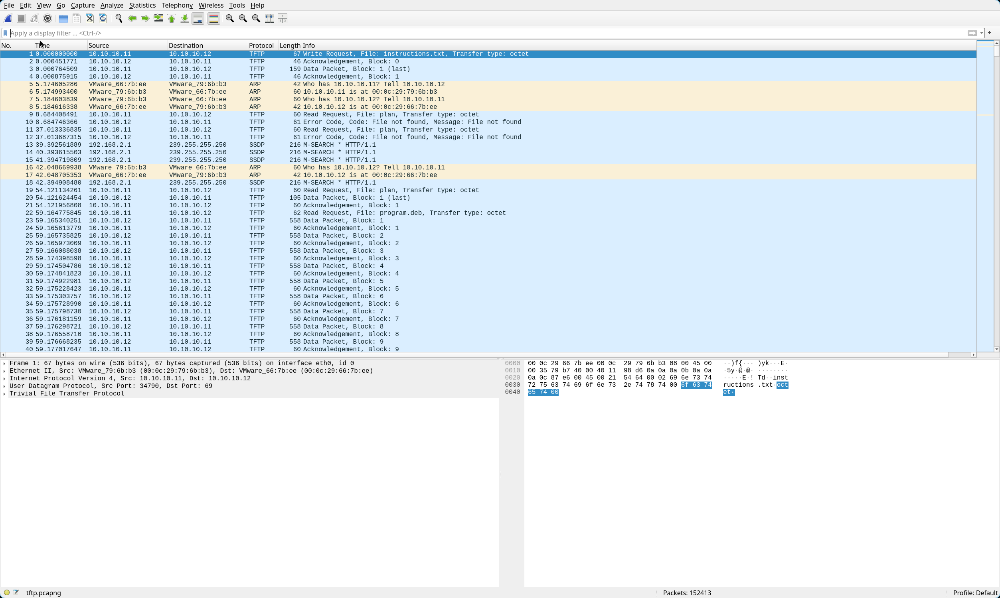
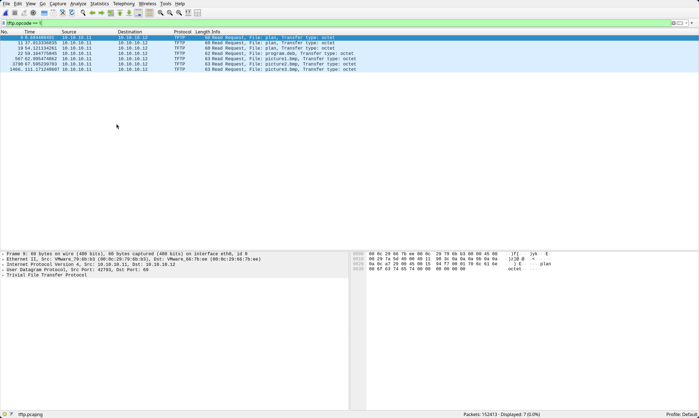

# 1. m00nwalk

> Decode this [message](https://jupiter.challenges.picoctf.org/static/14393e18d98fedbaedbc28896d7ef31a/message.wav) from the moon.

## Solution:

Opening up the sound file in Audacity and listening to the audio, I immediately though of the dial up modem sounds from a bygone era. This combined with the hint given in the challenge (How did pictures from the moon landing get sent back to Earth?), I figured out that the protocol being used was SSTV, ie Slow Scan Television.
Using an [online decoder](https://sstv-decoder.mathieurenaud.fr/), we get this image:


Taking the text in the image and putting it in the pictctf format, we get the flag
## Flag:

```
picoCTF{beep_boop_im_in_space}
```

## Concepts learnt:

- SSTV Format

## Notes:

- None

## Resources:

- [SSTV Decoder](https://sstv-decoder.mathieurenaud.fr/)
- [Format used to transmitting images from the moon](https://qr.ae/pC2wfF)


***

# 2. Trivial Flag Transfer Protocol

> Figure out how they moved the [flag](https://mercury.picoctf.net/static/4fe0f4357f7458c6892af394426eab55/tftp.pcapng).

## Solution:

We are given a `.pcapng` file in the challenge description. `.pcapng` files are an extension of `.pcap` files, and `.pcap` is a file format to store captured network packet data. Wireshark is a popular tool to open and analyze .pcapng files, however there seemed to be an issue with the latest versions not giving all the files, so I installed version `4.4.2` from `archive.archlinux.org`.

Upon opening up the file, we are presented with this:

This seems to be using the `TFTP` protocol, which is a simplified version of the file transfer protocol that doesn't use any encryption. 
We can clearly see certain packets that contain read requests for files sent from the client. Filtering for those using `tftp.opcode == 1` in the filter field, we get 5 distinct files:


We can extract them by going to File -> Export Objects -> TFTP -> Save All
This gives us 5 files:
`instructions.txt`:
```
GSGCQBRFAGRAPELCGBHEGENSSVPFBJRZHFGQVFTHVFRBHESYNTGENAFSRE.SVTHERBHGNJNLGBUVQRGURSYNTNAQVJVYYPURPXONPXSBEGURCYNA
```
`plan`:
```
VHFRQGURCEBTENZNAQUVQVGJVGU-QHRQVYVTRAPR.PURPXBHGGURCUBGBF
```
and three image files: `picture1.bmp`, `picture2.bmp`, `picture3.bmp`.
The two text files seem to be encrypted, and by looking at the ciphertext, I saw `.` in both the files, indicating that this must be using an encryption algorithm that doesn't change symbols and numbers. Scrolling through the encryption/decryption section in CyberChef, ROT13 seemed to make the most sense. Putting the ciphertext as input and ROT13 Decode as the recipe, we get the decryped files:
`instructions.txt`:
```
TFTPDOESNTENCRYPTOURTRAFFICSOWEMUSTDISGUISEOURFLAGTRANSFER.FIGUREOUTAWAYTOHIDETHEFLAGANDIWILLCHECKBACKFORTHEPLAN
```
After adding spaces:
```
TFTP DOESNT ENCRYPT OURT RAFFIC SO WE MUST DISGUISE OUR FLAG TRANSFER. FIGURE OUT A WAY TO HIDE THE FLAG AND I WILL CHECK BACK FOR THE PLAN
```

`plan`:
```
IUSEDTHEPROGRAMANDHIDITWITH-DUEDILIGENCE.CHECKOUTTHEPHOTOS
```
After adding spaces:
```
I USED THE PROGRAM AND HID IT WITH-DUEDILIGENCE. CHECK OUT THE PHOTOS
```
At this point the photos seemed to be just photos, so I moved on to the program.deb file. Since I use arch linux, I had to install a tool `debstop` that converts a `.deb` file into a corresponding arch `PKGBUILD` file. Viewing the PKGBUILD:
```
pkgname = steghide
pkgver = 0.5.1-1
pkgdesc = A steganography hiding tool. Steghide is steganography program which hides bits of a data file in some of the least significant bits of another file in such a way that the existence of the data file is not visible and cannot be proven. Steghide is designed to be portable and configurable and features hiding data in bmp, wav and au files, blowfish encryption, MD5 hashing of passphrases to blowfish keys, and pseudo-random distribution of hidden bits in the container data.
```
Looks like the `.deb` file was for `steghide`, a tool used to embed and extract hidden data in other files. This is the process of steganography (the practice of hiding information within other, non-secret files or messages so that the existence of the concealed information is not obvious).

I tried extracting the data, but quickly came to the realization that we need a password. After a lot of flailing around (and trying to bruteforce the password using the rock-you wordlist), I looked up a hint and realized that the password was hidden in plain sight in the `plan` folder. Notice "HID IT WITH DUEDILIGENCE", meaning the password is `DUEDILIGENCE`. 
So doing `steghide extract -sf <file>` on the three images and entering the passphrase yielded results for `picture3.bmp`.
```console
steghide extract -sf picture3.bmp
Enter passphrase: 
wrote extracted data to "flag.txt".

cat flag.txt 
picoCTF{h1dd3n_1n_pLa1n_51GHT_18375919}
```


## Flag:

```
picoCTF{h1dd3n_1n_pLa1n_51GHT_18375919}
```

## Concepts learnt:

- Steganography
- Analyzing network captures using WireShark

## Notes:

- None

## Resources:

- None


***

