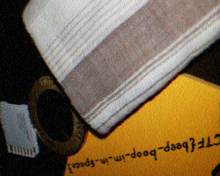

# 1. m00nwalk

> Decode this [message](https://jupiter.challenges.picoctf.org/static/14393e18d98fedbaedbc28896d7ef31a/message.wav) from the moon.

## Solution:

Opening up the sound file in Audacity and listening to the audio, I immediately though of the dial up modem sounds from a bygone era. This combined with the hint given in the challenge (How did pictures from the moon landing get sent back to Earth?), I figured out that the protocol being used was SSTV, ie Slow Scan Television.
Using an [online decoder](https://sstv-decoder.mathieurenaud.fr/), we get this image:



Taking the text in the image and putting it in the pictctf format, we get the flag
## Flag:

```
picoCTF{beep_boop_im_in_space}
```

## Concepts learnt:

- SSTV Format

## Notes:

- None

## Resources:

- [SSTV Decoder](https://sstv-decoder.mathieurenaud.fr/)
- [Format used to transmitting images from the moon](https://qr.ae/pC2wfF)


***
