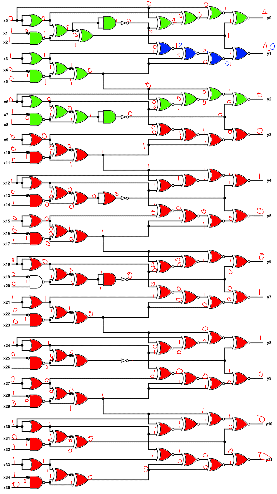
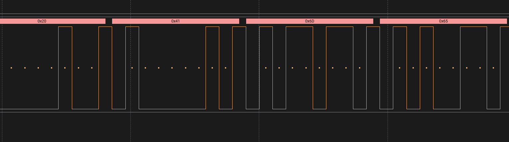
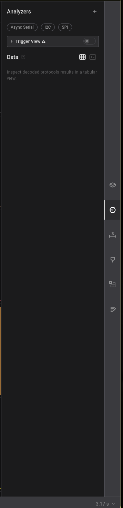
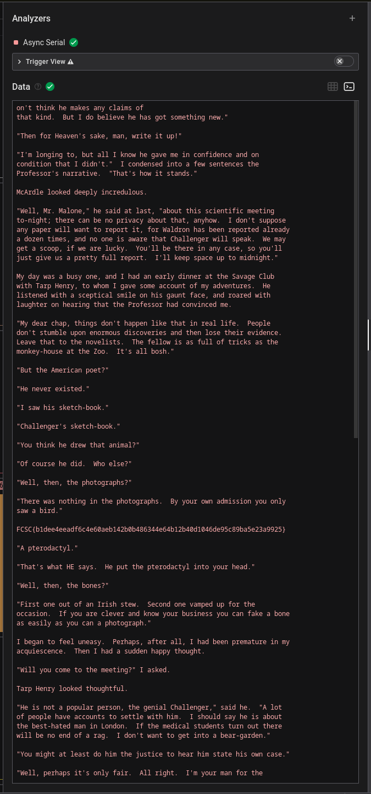

# 1. IQ Test

> let your input x = 30478191278. wrap your answer with nite{ } for the flag. As an example, entering x = 34359738368 gives (y0, ..., y11), so the flag would be nite{010000000011}.

## Solution:

The most obvious step here is to convert x into a binary. given that there are 36 inputs, we pad x into a 36-bit number by adding a 0 to the left. x is now `011100011000101001000100101010101110`.

In the given image, we see a big circuit of logic gates, consisting of OR, AND, XOR, and their respecting NOT versions (NOR, NAND, XNOR).

Given that we must find the outputs `y0, y1, ..., y11` to find the flag, it is a simple but tedious matter of following the logic having substituted the inputs for their corresponding bits.

I did this manually by editing the image file, as shown below. I personally used color schemes to keep track of what is done, verified and previously incorrect (RED, GREEN and BLUE respectively).



## Flag:

```
nite{100010011000}
```

## Concepts learnt:

- Logic gates

## Notes:

- Went on a different approach trying to implement the circuit in a logic gate simulator online but lowk too much effort, just did it by hand.

## Resources:

- None.


***


# 2. I Like Logic

> i like logic and i like files, apparently, they have something in common, what should my next step be.

## Solution:

I looked up what a .sal file is supposed to be, and turns out its the file format for `Saelae Logic 2 Analyzer`. Opening the program and importing the file for the first time, we see some data in Channel 3, which shows a signal and its digital timing diagram.


The program also gave me a tour, and the Analyzers section seemed like the most logical step.

I selected Async Serial, and switched to the terminal tab, and lo and behold there was ASCII text.

Scrolling through this text, we see a line that looks similar to the format of a CTF Flag.

```
on't think he makes any claims of
that kind.  But I do believe he has got something new."

"Then for Heaven's sake, man, write it up!"

"I'm longing to, but all I know he gave me in confidence and on
condition that I didn't."  I condensed into a few sentences the
Professor's narrative.  "That's how it stands."

McArdle looked deeply incredulous.

"Well, Mr. Malone," he said at last, "about this scientific meeting
to-night; there can be no privacy about that, anyhow.  I don't suppose
any paper will want to report it, for Waldron has been reported already
a dozen times, and no one is aware that Challenger will speak.  We may
get a scoop, if we are lucky.  You'll be there in any case, so you'll
just give us a pretty full report.  I'll keep space up to midnight."

My day was a busy one, and I had an early dinner at the Savage Club
with Tarp Henry, to whom I gave some account of my adventures.  He
listened with a sceptical smile on his gaunt face, and roared with
laughter on hearing that the Professor had convinced me.

"My dear chap, things don't happen like that in real life.  People
don't stumble upon enormous discoveries and then lose their evidence.
Leave that to the novelists.  The fellow is as full of tricks as the
monkey-house at the Zoo.  It's all bosh."

"But the American poet?"

"He never existed."

"I saw his sketch-book."

"Challenger's sketch-book."

"You think he drew that animal?"

"Of course he did.  Who else?"

"Well, then, the photographs?"

"There was nothing in the photographs.  By your own admission you only
saw a bird."

FCSC{b1dee4eeadf6c4e60aeb142b0b486344e64b12b40d1046de95c89ba5e23a9925}

"A pterodactyl."

"That's what HE says.  He put the pterodactyl into your head."

"Well, then, the bones?"

"First one out of an Irish stew.  Second one vamped up for the
occasion.  If you are clever and know your business you can fake a bone
as easily as you can a photograph."

I began to feel uneasy.  Perhaps, after all, I had been premature in my
acquiescence.  Then I had a sudden happy thought.

"Will you come to the meeting?" I asked.

Tarp Henry looked thoughtful.

"He is not a popular person, the genial Challenger," said he.  "A lot
of people have accounts to settle with him.  I should say he is about
the best-hated man in London.  If the medical students turn out there
will be no end of a rag.  I don't want to get into a bear-garden."

"You might at least do him the justice to hear him state his own case."

"Well, perhaps it's only fair.  All right.  I'm your man for the
evening."

When we arrived at the hall we found a much greater concourse than I
had expected.  A line of electric broughams discharged their little
cargoes of white-bearded professors, while the dark stream of humbler
pedestrians, who crowded through the arched door-way, showed that the
audience would be popular as well as scientific.  Indeed, it became
evident to us as soon as we had taken our seats that a youthful and
even boyish spirit was abroad in the gallery and the back portions of
the hall.  Looking behind me, I could see rows of faces of the familiar
medical student type.  Apparently the great hospitals had each sent
down their contingent.  The behavior of the audience at present was
good-humored, but mischievous.  Scraps of popular songs were chorused
with an enthusiasm which was a strange prelude to a scientific lecture,
and there was already a tendency to personal chaff which promised a
jovial evening to others, however embarrassing it might be to the
recipients of these dubious honors.

Thus, when old Doctor Meldrum, with his well-known curly-brimmed
opera-hat, appeared upon the platform, there was such a universal query
of "Where DID you get that tile?" that he hurriedly removed it, and
concealed it furtively under his chair.  When gouty Professor Wadley
limped down to his seat there were general affectionate inquiries from
all parts of the hall as to the exact state of his poor toe, which
caused him obvious embarrassment.  The greatest demonstration of all,
however, was at the entrance of my new acquaintance, Professor
Challenger, when he passed down to take his place at the extreme end of
the front row of the platform.  Such a yell of welcome broke forth when
his black beard first protruded round the corner that I began to
suspect Tarp Henry was right in his surmise, and that this assemblage
was there not merely for the sake of the lecture, but because it had
got rumored abroad that the famous Professor would take part in the
proceedings.

There was some sympathetic laughter on his entrance among the front
benches of well-dressed spectators, as though the demonstration of the
students in this instance was not unwelcome to them.  That greeting
was, indeed, a frightful outburst of sound, the uproar of the carnivora
cage when the step of the bucket-bearing keeper is heard in the
distance.  There was an offensive tone in it, perhaps, and yet in the
main it struck me as mere riotous outcry, the noisy reception of one
who amused and interested them, rather than of one they disliked or
despised.  Challenger smiled with weary and tolerant contempt, as a
kindly man would meet the yapping of a litter of puppies.  He sat
slowly down, blew out his chest, passed his hand caressingly down his
beard, and looked with drooping eyelids and supercilious eyes at the
crowded hall before him.  The uproar of his advent had not yet died
away when Professor Ronald Murray, the chairman, and Mr. Waldron, the
lecturer, threaded their way to the front, and the proceedings began.

Professor Murray will, I am sure, excuse me if I say that he has the
common fault of most Englishmen of being inaudible.  Why on earth
people who have something to say which is worth hearing should not take
the slight trouble to learn how to make it heard is one of the strange
mysteries of modern life.  Their methods are as reasonable as to try to
pour some precious stuff from the spring to the reservoir through a
non-conducting pipe, which could by the least effort be opened.
Professor Murray made several profound remarks to his white tie and to
the water-carafe upon the table, with a humorous, twinkling aside to
the silver candlestick upon his right.  Then he sat down, and Mr.
Waldron, the famous popular lecturer, rose amid a general murmur of
applause.  He was a stern, gaunt man, with a harsh voice, and an
aggressive manner, but he had the merit of knowing how to assimilate
the ideas of other men, and to pass them on in a way which was
intelligible and even interesting to the lay public, with a happy knack
of being funny about the most unlikely objects, so that the precession
of the Equinox or the formation of a vertebrate became a highly
humorous process as treated by him.

It was a bird's-eye view of creation, as interpreted by science, which,
in language always clear and sometimes picturesque, he unfolded before
us.  He told us of t
```

## Flag:

```
FCSC{b1dee4eeadf6c4e60aeb142b0b486344e64b12b40d1046de95c89ba5e23a9925}
```

## Concepts learnt:

- Signal analyzing software like Saelae Logic 2 Analyzer
- That data can be encoded in electronic signals.

## Notes:

- Tried a lot of other single input channel analyzers because I was focusing on the fact that the text seemed to be cut off at the beginning and the end, then realized that the flag was right there in the middle.

## Resources:

- None


***

# 3. Bare Metal Alchemist

> my friend recommended me this anime but i think i've heard a wrong name.

# Solution

Running file on the executable, we see:
```
file firmware.elf 
firmware.elf: ELF 32-bit LSB executable, Atmel AVR 8-bit, version 1 (SYSV), statically linked, with debug_info, not stripped
```
After seeing this, I googled Atmel AVR, which seems to be an 8bit microcontroller
I selected the file in ghidra (you have to set the language to `avr8:LE:16:default`), we can disassemble the program and look at the generated C code.
In the main function:
```C

void main(void)

{
  char cVar1;
  byte bVar2;
  char cVar3;
  undefined2 uStack_5;
  undefined2 uStack_3;
  undefined1 uStack_1;
  
  R1 = 0;
  uStack_1 = Y._1_1_;
  uStack_3 = 0xbe;
  //Shortened for brevity
  R13 = '\0';
  do {
    R25R24._0_1_ = DAT_mem_0029;
    R25R24._0_1_ = (byte)R25R24 ^ (byte)R25R24 * '\x02';
    if (((byte)R25R24 & 4) == 0) {
      uStack_5 = (undefined *)0x141;
      z1();
    }
    else {
      R15R14 = (byte *)0x68;
      R16 = 0;
      while( true ) {
        Z = R15R14;
        R25R24._0_1_ = *R15R14;
        if ((byte)R25R24 == 0) break;
        Z._1_1_ = (undefined1)((uint)R15R14 >> 8);
        Z._0_1_ = (byte)R25R24 ^ R11;
        if ((byte)R25R24 == 0xa5) break;
        R25R24._0_1_ = DAT_mem_0029;
        R25R24._0_1_ = (byte)R25R24 ^ (byte)R25R24 * '\x02';
        if (((byte)R25R24 & 4) == 0) {
          uStack_5 = (undefined *)0x131;
          z1();
          break;
        }
        Z._0_1_ = (byte)Z - 0x30;
        R17 = 0;
        if ((byte)Z < 0x4e) {
          Z = (byte *)CONCAT11(1,(byte)Z);
          R17 = *Z;
        }
        uStack_5 = &DAT_mem_0151;
        z1();
        if ((R17 & 1) != 0) {
          bVar2 = DAT_mem_002b;
          DAT_mem_002b = bVar2 | 8;
        }
        if ((R17 & 2) != 0) {
          bVar2 = DAT_mem_002b;
          DAT_mem_002b = bVar2 | 0x10;
        }
        if ((R17 & 4) != 0) {
          bVar2 = DAT_mem_002b;
          DAT_mem_002b = bVar2 | 0x20;
        }
        if ((R17 & 8) != 0) {
          bVar2 = DAT_mem_002b;
          DAT_mem_002b = bVar2 | 0x40;
        }
        if ((R17 & 0x10) != 0) {
          bVar2 = DAT_mem_002b;
          DAT_mem_002b = bVar2 | 0x80;
        }
        if ((R17 & 0x20) != 0) {
          bVar2 = DAT_mem_0025;
          DAT_mem_0025 = bVar2 | 1;
        }
        if ((R17 & 0x40) != 0) {
          bVar2 = DAT_mem_0025;
          DAT_mem_0025 = bVar2 | 2;
        }
        R25R24._0_1_ = R16 & 0x1f;
        cVar3 = (byte)R25R24 + 0x2d;
        while (cVar1 = cVar3 + -1, cVar3 != '\0') {
          Z = (byte *)0xf9f;
          do {
            Z = (byte *)((int)Z + -1);
            cVar3 = cVar1;
          } while (Z != (byte *)0x0);
        }
        R15R14 = (byte *)CONCAT11(R15R14._1_1_ - (((char)R15R14 != -1) + -1),(char)R15R14 + '\x01');
        R16 = R16 + 0x25;
      }
      *(byte *)(Y + 2) = R1;
      *(byte *)(Y + 1) = R1;
      while( true ) {
        R25R24._0_1_ = *(byte *)(Y + 1);
        R25R24._1_1_ = *(char *)(Y + 2);
        if (R25R24._1_1_ != '\0' && ((byte)R25R24 < 0x2c) <= (byte)(R25R24._1_1_ - 1U)) break;
        R25R24 = *(int *)(Y + 1) + 1;
        *(char *)(Y + 2) = R25R24._1_1_;
        *(byte *)(Y + 1) = (byte)R25R24;
      }
    }
    if (R12 != R1 || R13 != (byte)(R1 + (R12 < R1))) {
      uStack_5 = (undefined *)0x146;
      __vectors();
    }
  } while( true );
}
```
I don't understand half of this, but we can see that there are XOR operations going on, and if previous challenges are to go by, then the flag is being xored. This means that the XORed version of the flag is hardcoded into the executable, and we can bruteforce it by trying to all 256 bytes as the second operand:
```python
import re

fw = open("firmware.elf", "rb").read()
p = re.compile(rb"[A-Za-z0-9_]{1,20}\{[A-Za-z0-9_\-\+\=\/\\\.\s]{10,200}\}")

for i in range(256):
    print("testing", i)
    xored = bytes(b ^ i for b in fw)
    found = p.search(xored)
    if found:
        print("=========", found.group().decode(), "=========")
```


```
testing 0
testing 1
testing 2
testing 3
testing 4
testing 5
testing 6
testing 7
testing 8
testing 9
testing 10
testing 11
========= yjf{dgbenxTneo
                        TT} =========
testing 12
 shortened for brevity
testing 57
========= 9mnxtk9mn{k9mnzk9mnjk9mn} =========
testing 58
# shortened for brevity
testing 66
========= HBB{vBALxIyI
                      Q} =========
testing 67
# shortened for brevity
testing 107
========= mzjyjhcpcNcxnkkkjzk{mzjyjhcpcNcxnkkk} =========
testing 108
# shortened for brevity
testing 165
========= TFCCTF{Th1s_1s_som3_s1mpl3_4rdu1no_f1rmw4re} =========
testing 166
# shortened for brevity
testing 255
```

# Flag
```
TFCCTF{Th1s_1s_som3_s1mpl3_4rdu1no_f1rmw4re}
```

# Concepts Learnt:
- Decompile executables made for different machines

# Notes
- what even was this :(

