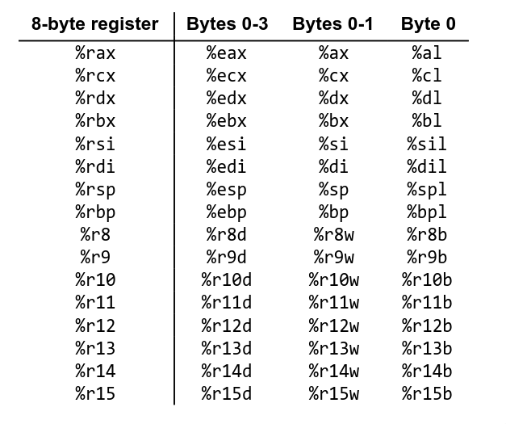

# NOTE:
All the challenges below uses the following script I made to make it easier to solve the challenges:
```python
from pwn import *

context.update(arch="amd64")
code = ""
while True:
    line = input()
    if line == "done":
        break
    code = code + line + "\n"
code = asm(code.strip())

p = process("/challenge/run")
p.send(code)

print(p.recvall().decode())
```
This let's me simply call the script, input all the asm instructions, then give it to `/challenge/run`.
# 1. set-register

### Solution:
```asm
mov rdi, 0x1337
```

Self explanatory.

### Output:
```
hacker@assembly-crash-course~set-register:~$ python solve.py
mov rdi, 0x1337
 done
[+] Starting local process '/challenge/run': pid 353
[+] Receiving all data: Done (571B)
[*] Process '/challenge/run' stopped with exit code 0 (pid 353)

In this level you will be working with registers. You will be asked to modify
or read from registers.


In this level you will work with registers! Please set the following:
  rdi = 0x1337

You ran me without an argument. You can re-run with `/challenge/run /path/to/your/elf` to input an ELF file, or just give me your assembled and extracted code in bytes (up to 0x1000 bytes): 
Executing your code...
---------------- CODE ----------------
0x400000:	mov   	rdi, 0x1337
--------------------------------------
pwn.college{s2nr95VPkkUoxvPz1JOXZyzrU2I.dRTOxwSN3AzNzEzW}
```

### Flag:
```
pwn.college{s2nr95VPkkUoxvPz1JOXZyzrU2I.dRTOxwSN3AzNzEzW}
```

***

# 2. set-multiple-registers

### Solution:
```asm
mov eax, 0x1337
mov r12, 0xCAFED00D1337BEEF
mov esp, 0x31337
```

Using `eax` and `esp` instead of `rax` and `rsp` is better in this case, because on `x86_64`, it gets zero-extended into `rax` and `rsp` and is apparently better for performance reasons. I discovered this fact midway through solving these challenges, so up to a certain point I use full 64-bit registers.

### Output:
```
hacker@assembly-crash-course~set-multiple-registers:~$ python solve.py
mov eax, 0x1337
mov r12, 0xCAFED00D1337BEEF
mov esp, 0x31337
done
[+] Starting local process '/challenge/run': pid 154
[+] Receiving all data: Done (696B)
[*] Process '/challenge/run' stopped with exit code 0 (pid 154)

In this level you will be working with registers. You will be asked to modify
or read from registers.


In this level you will work with multiple registers. Please set the following:
  rax = 0x1337
  r12 = 0xCAFED00D1337BEEF
  rsp = 0x31337

You ran me without an argument. You can re-run with `/challenge/run /path/to/your/elf` to input an ELF file, or just give me your assembled and extracted code in bytes (up to 0x1000 bytes): 
Executing your code...
---------------- CODE ----------------
0x400000:	mov   	eax, 0x1337
0x400007:	movabs	r12, 0xcafed00d1337beef
0x400011:	mov   	esp, 0x31337
--------------------------------------
pwn.college{Y1C9vowTA3NNVKjd26p1j4QizRL.QXwEDOzwSN3AzNzEzW}
```

### Flag:
```
pwn.college{Y1C9vowTA3NNVKjd26p1j4QizRL.QXwEDOzwSN3AzNzEzW}
```

***
### Note: Outputs henceforth will be shortened for brevity
# 3. add-to-register

### Solution:
```asm
add rdi, 0x331337
```

Self explanatory.

### Output:
```
hacker@assembly-crash-course~add-to-register:~$ python solve.py
add rdi, 0x331337
 done
[+] Starting local process '/challenge/run': pid 152
[+] Receiving all data: Done (1.33KB)
[*] Process '/challenge/run' stopped with exit code 0 (pid 152)
...
Executing your code...
---------------- CODE ----------------
0x400000:	add   	rdi, 0x331337
--------------------------------------
pwn.college{gdX0-GsC5eXGce8V8tK05mSehH9.dVTOxwSN3AzNzEzW}
```

### Flag:
```
pwn.college{gdX0-GsC5eXGce8V8tK05mSehH9.dVTOxwSN3AzNzEzW}
```

***
# 4. linear-equation-registers

### Solution:
```asm
imul rdi, rsi
add rdi, rdx
mov rax, rdi
```

Self explanatory.
Note: `add op1, op2, op3` is seemingly not valid, and `add` can take only 2 operands (at least in x86/x86_64 assembly7z)

### Output:
```
hacker@assembly-crash-course~linear-equation-registers:~$ python solve.py
imul rdi, rsi
add rdi, rdx
mov rax, rdi
done
[+] Starting local process '/challenge/run': pid 166
[+] Receiving all data: Done (1.30KB)
[*] Process '/challenge/run' stopped with exit code 0 (pid 166)
...
Executing your code...
---------------- CODE ----------------
0x400000:	imul  	rdi, rsi
0x400004:	add   	rdi, rdx
0x400007:	mov   	rax, rdi
--------------------------------------
pwn.college{cEHe9_fpvnqqMJnMx6zPuKZEVx6.dZTOxwSN3AzNzEzW}
```

### Flag:
```
pwn.college{cEHe9_fpvnqqMJnMx6zPuKZEVx6.dZTOxwSN3AzNzEzW}
```

***
# 5. integer-division

### Solution:
```asm
mov rdx, 0x0
mov rax, rdi
div rsi
```

`div reg` does `rdx:rax` / `reg`
Result is stored in:
`rax` - quotient
`rdx` - remainder

### Output:
```
hacker@assembly-crash-course~integer-division:~$ python solve.py
mov rdx, 0x0
mov rax, rdi
div rsi
done
[+] Starting local process '/challenge/run': pid 169
[+] Receiving all data: Done (1.96KB)
[*] Process '/challenge/run' stopped with exit code 0 (pid 169)
...
Executing your code...
---------------- CODE ----------------
0x400000:	mov   	rdx, 0
0x400007:	mov   	rax, rdi
0x40000a:	div   	rsi
--------------------------------------
pwn.college{klfP98nO5VGhbF7rbXiCGf3aOZL.ddTOxwSN3AzNzEzW}
```

### Flag:
```
pwn.college{klfP98nO5VGhbF7rbXiCGf3aOZL.ddTOxwSN3AzNzEzW}
```

***
# 6. modulo-operation

### Solution:
```asm
mov rdx, 0x0
mov rax, rdi
div rsi
mov rax, rdx
```

We use the same `div` instruction which returns the remainder in `rdx`.

### Output:
```
hacker@assembly-crash-course~modulo-operation:~$ python solve.py
mov rdx, 0x0
mov rax, rdi
div rsi
mov rax, rdx
done
[+] Starting local process '/challenge/run': pid 152
[+] Receiving all data: Done (1.28KB)
[*] Process '/challenge/run' stopped with exit code 0 (pid 152)

...
Executing your code...
---------------- CODE ----------------
0x400000:	mov   	rdx, 0
0x400007:	mov   	rax, rdi
0x40000a:	div   	rsi
0x40000d:	mov   	rax, rdx
--------------------------------------
pwn.college{Y6AVQOcb4ODQfVb2c8RiEg2imAt.dhTOxwSN3AzNzEzW}
```

### Flag:
```
pwn.college{Y6AVQOcb4ODQfVb2c8RiEg2imAt.dhTOxwSN3AzNzEzW}
```

***
# 7. set-upper-byte

### Solution:
```asm
mov ah, 0x42
```

Hierarchy goes like:
`rax` -> `eax` -> `ax` -> `ah` and `al`
Naming conventions differ for different registers. For example, for `rsi`:
`rsi` -> `esi` -> `si` -> `sil`
Other registers: (source: https://cs.brown.edu/courses/cs033/docs/guides/x64_cheatsheet.pdf)


### Output:
```
hacker@assembly-crash-course~set-upper-byte:~$ python solve.py
mov ah, 0x42
done
[+] Starting local process '/challenge/run': pid 201
[+] Receiving all data: Done (1.84KB)
[*] Process '/challenge/run' stopped with exit code 0 (pid 201)
...
Executing your code...
---------------- CODE ----------------
0x400000:	mov   	ah, 0x42
--------------------------------------
pwn.college{oVJmISeODQCO-HcmxMx1y0WzsPH.QXxEDOzwSN3AzNzEzW}
```

### Flag:
```
pwn.college{oVJmISeODQCO-HcmxMx1y0WzsPH.QXxEDOzwSN3AzNzEzW}
```

***
# 8. efficient-modulo

### Solution:
```asm
mov rax, 0x0
mov rbx, 0x0
mov al, dil
mov bx, si
```

In theory, it is necessary to zero out the registers first before setting the lower bytes, since any previous bits stored there might interfere with the result. This is only for 8bit/16bit register names, since it automatically gets zeroed out with 32bit registers (for performance reasons).

### Output:
```
hacker@assembly-crash-course~efficient-modulo:~$ python solve.py
mov rax, 0x0
mov rbx, 0x0
mov al, dil
mov bx, si
done
[+] Starting local process '/challenge/run': pid 166
[+] Receiving all data: Done (1.39KB)
[*] Process '/challenge/run' stopped with exit code 0 (pid 166)
...
Executing your code...
---------------- CODE ----------------
0x400000:	mov   	rax, 0
0x400007:	mov   	rbx, 0
0x40000e:	mov   	al, dil
0x400011:	mov   	bx, si
--------------------------------------
pwn.college{AKL1ZIO2MB_227FHxsKmyGM49oX.dlTOxwSN3AzNzEzW}
```

### Flag:
```
pwn.college{AKL1ZIO2MB_227FHxsKmyGM49oX.dlTOxwSN3AzNzEzW}
```

***
# 9. byte-extraction

### Solution:
```asm
shl rdi, 0x18
shr rdi, 0x38
mov rax, rdi
```

Shift left to zero out all bytes on the left, then shift right to zero out all bytes on the right.
Another possible approach is to just shift right and extract the lowest byte.

### Output:
```
hacker@assembly-crash-course~byte-extraction:~$ python solve.py
shl rdi, 0x18
shr rdi, 0x38
mov rax, rdi
done
[+] Starting local process '/challenge/run': pid 167
[+] Receiving all data: Done (2.23KB)
[*] Process '/challenge/run' stopped with exit code 0 (pid 167)
...
Executing your code...
---------------- CODE ----------------
0x400000:	shl   	rdi, 0x18
0x400004:	shr   	rdi, 0x38
0x400008:	mov   	rax, rdi
--------------------------------------
pwn.college{Up4DWzXvi3VMYKNKAss8FyzqKr_.dBDMywSN3AzNzEzW}
```

### Flag:
```
pwn.college{Up4DWzXvi3VMYKNKAss8FyzqKr_.dBDMywSN3AzNzEzW}
```

***
# 10. bitwise-and

### Solution:
```asm
and rdi, rsi
and rax, rdi
```

1 AND X = X
This is how we are able to store the result in `rax` without a `mov` command (`rax`) is filled with 1's beforehand.

### Output:
```
hacker@assembly-crash-course~bitwise-and:~$ python solve.py
and rdi, rsi
and rax, rdi
done
[+] Starting local process '/challenge/run': pid 152
[+] Receiving all data: Done (2.19KB)
[*] Process '/challenge/run' stopped with exit code 0 (pid 152)
...
Executing your code...
---------------- CODE ----------------
0x400000:	and   	rdi, rsi
0x400003:	and   	rax, rdi
--------------------------------------
pwn.college{0S_6koG3o-gEnqYo8rx7q2bSyQ5.dFDMywSN3AzNzEzW}
```

### Flag:
```
pwn.college{0S_6koG3o-gEnqYo8rx7q2bSyQ5.dFDMywSN3AzNzEzW}
```

***
# 11. check-even

### Solution:
```asm
and rdi, 0x1
xor rdi, 0x1
and rax, rdi
```

The first and operation returns the LSB of `rdi`. If the LSB is 1, it's an odd number, else even. However, since the requirements need the opposite, we use XOR to invert that LSB. We then use `and` to store it in `rax` (we are making the assumption that `rax` is filled with 1's like the previous challenge).

### Output:
```
hacker@assembly-crash-course~check-even:~$ python solve.py
and rdi, 0x1
xor rdi, 0x1
and rax, rdi
done
[+] Starting local process '/challenge/run': pid 156
[+] Receiving all data: Done (1.30KB)
[*] Process '/challenge/run' stopped with exit code 0 (pid 156)
...
Executing your code...
---------------- CODE ----------------
0x400000:	and   	rdi, 1
0x400004:	xor   	rdi, 1
0x400008:	and   	rax, rdi
--------------------------------------
pwn.college{MuAuKUEAUhXNQZicyaycqHR-aGS.dJDMywSN3AzNzEzW}
```

### Flag:
```
pwn.college{MuAuKUEAUhXNQZicyaycqHR-aGS.dJDMywSN3AzNzEzW}
```

***
# 12. memory-read

### Solution:
```asm
mov rax, [0x404000]
```

Self explanatory.

### Output:
```
hacker@assembly-crash-course~memory-read:~$ python solve.py
mov rax, [0x404000]
done
[+] Starting local process '/challenge/run': pid 152
[+] Receiving all data: Done (2.64KB)
[*] Process '/challenge/run' stopped with exit code 0 (pid 152)
...
Executing your code...
---------------- CODE ----------------
0x400000:	mov   	rax, qword ptr [0x404000]
--------------------------------------
pwn.college{MEDoayONjDcKHDWXZNPl9uln9yR.QXyEDOzwSN3AzNzEzW}
```

### Flag:
```
pwn.college{MEDoayONjDcKHDWXZNPl9uln9yR.QXyEDOzwSN3AzNzEzW}
```

***
# 13. memory-write

### Solution:
```asm
mov [0x404000], rax
```

Self explanatory.

### Output:
```
hacker@assembly-crash-course~memory-write:~$ python solve.py
mov [0x404000], rax
done
[+] Starting local process '/challenge/run': pid 152
[+] Receiving all data: Done (1.14KB)
[*] Process '/challenge/run' stopped with exit code 0 (pid 152)
...
Executing your code...
---------------- CODE ----------------
0x400000:	mov   	qword ptr [0x404000], rax
--------------------------------------
pwn.college{kznyYkiPs7kyO1uXIbzfRm46IV5.QXzEDOzwSN3AzNzEzW}
```

### Flag:
```
pwn.college{kznyYkiPs7kyO1uXIbzfRm46IV5.QXzEDOzwSN3AzNzEzW}
```

***
# 14. memory-increment

### Solution:
**Approach 1:**
```asm
mov rax, [0x404000]
mov rdi, 0x1337
add rdi, rax
mov [0x404000], rdi
```
This approach loads the value into a register, increments it, then writes it back into memory

**Approach 2:**
```asm
mov rax, [0x404000]
addq [0x404000], 0x1337
```
This approach does it in place. I initially tried doing `add qword [0x404000], 0x1337`, however due to assembler specific nuances this didn't work. Using GNU AS' equivalent `addq` works (`addq` is for adding qwords).
### Output:
Approach 1:
```
hacker@assembly-crash-course~memory-increment:~$ python solve.py
mov rax, [0x404000]
mov rdi, 0x1337
add rdi, rax
mov [0x404000], rdi
done
[+] Starting local process '/challenge/run': pid 176
[+] Receiving all data: Done (1.43KB)
[*] Process '/challenge/run' stopped with exit code 0 (pid 176)
...
Executing your code...
---------------- CODE ----------------
0x400000:	mov   	rax, qword ptr [0x404000]
0x400008:	mov   	rdi, 0x1337
0x40000f:	add   	rdi, rax
0x400012:	mov   	qword ptr [0x404000], rdi
--------------------------------------
pwn.college{0C4IJcvWs_Jzu8w5q7EAO17un3v.dNDMywSN3AzNzEzW}
```
Approach 2:
```
hacker@assembly-crash-course~memory-increment:~$ python solve.py
mov rax, [0x404000]
addq [0x404000], 0x1337
done
[+] Starting local process '/challenge/run': pid 198
[+] Receiving all data: Done (1.38KB)
[*] Process '/challenge/run' stopped with exit code 0 (pid 198)
...
Executing your code...
---------------- CODE ----------------
0x400000:	mov   	rax, qword ptr [0x404000]
0x400008:	add   	qword ptr [0x404000], 0x1337
--------------------------------------
pwn.college{0C4IJcvWs_Jzu8w5q7EAO17un3v.dNDMywSN3AzNzEzW}
```

### Flag:
```
pwn.college{0C4IJcvWs_Jzu8w5q7EAO17un3v.dNDMywSN3AzNzEzW}
```

***
# 15. byte-access

### Solution:
```asm
mov rax, 0x0
mov al, [0x404000]
```

Self explanatory.

### Output:
```
hacker@assembly-crash-course~byte-access:~$ python solve.py
mov rax, 0x0
mov al, [0x404000]
done
[+] Starting local process '/challenge/run': pid 152
[+] Receiving all data: Done (2.10KB)
[*] Process '/challenge/run' stopped with exit code 0 (pid 152)
...
Executing your code...
---------------- CODE ----------------
0x400000:	mov   	rax, 0
0x400007:	mov   	al, byte ptr [0x404000]
--------------------------------------
pwn.college{E2cwRyuQJz4jP96SiLaC9kUCghU.QX0EDOzwSN3AzNzEzW}
```

### Flag:
```
pwn.college{E2cwRyuQJz4jP96SiLaC9kUCghU.QX0EDOzwSN3AzNzEzW}
```

***
# 16. memory-size-access

### Solution:
```asm
mov al, [0x404000]
mov bx, [0x404000] 
mov ecx, [0x404000]
mov rdx, [0x404000]
```

Self explanatory.

### Output:
```
hacker@assembly-crash-course~memory-size-access:~$ python solve.py
mov al, [0x404000]
mov bx, [0x404000] 
mov ecx, [0x404000]
mov rdx, [0x404000]
done
[+] Starting local process '/challenge/run': pid 152
[+] Receiving all data: Done (2.07KB)
[*] Process '/challenge/run' stopped with exit code 0 (pid 152)
...
Executing your code...
---------------- CODE ----------------
0x400000:	mov   	al, byte ptr [0x404000]
0x400007:	mov   	bx, word ptr [0x404000]
0x40000f:	mov   	ecx, dword ptr [0x404000]
0x400016:	mov   	rdx, qword ptr [0x404000]
--------------------------------------
pwn.college{o8tmW9JnET3RilRGEhJ9sRGSZTn.dRDMywSN3AzNzEzW}
```

### Flag:
```
pwn.college{o8tmW9JnET3RilRGEhJ9sRGSZTn.dRDMywSN3AzNzEzW}
```

***
# 17. little-ending-write

### Solution:
```asm
mov rax, 0xdeadbeef00001337
mov rbx, 0xc0ffee0000
mov [rdi], rax
mov [rsi], rbx
```

Self explanatory.

### Output:
```
hacker@assembly-crash-course~little-endian-write:~$ python solve.py
mov rax, 0xdeadbeef00001337
mov rbx, 0xc0ffee0000
mov [rdi], rax
mov [rsi], rbx
done
[+] Starting local process '/challenge/run': pid 160
[+] Receiving all data: Done (2.17KB)
[*] Process '/challenge/run' stopped with exit code 0 (pid 160)
...
Executing your code...
---------------- CODE ----------------
0x400000:	movabs	rax, 0xdeadbeef00001337
0x40000a:	movabs	rbx, 0xc0ffee0000
0x400014:	mov   	qword ptr [rdi], rax
0x400017:	mov   	qword ptr [rsi], rbx
--------------------------------------
pwn.college{oaYKNpjRCJSh9Qz_nBgIkAeAL-G.dVDMywSN3AzNzEzW}
```

### Flag:
```
pwn.college{oaYKNpjRCJSh9Qz_nBgIkAeAL-G.dVDMywSN3AzNzEzW}
```

***
# 18. memory-sum

### Solution:
```asm
mov rax, [rdi]
mov rbx, [rdi+8]
add rax, rbx
mov [rsi], rax
```

Self explanatory.

### Output:
```
hacker@assembly-crash-course~memory-sum:~$ python solve.py
mov rax, [rdi]
mov rbx, [rdi+8]
add rax, rbx
mov [rsi], rax
done
[+] Starting local process '/challenge/run': pid 235
[+] Receiving all data: Done (1.93KB)
[*] Process '/challenge/run' stopped with exit code 0 (pid 235)
...
Executing your code...
---------------- CODE ----------------
0x400000:	mov   	rax, qword ptr [rdi]
0x400003:	mov   	rbx, qword ptr [rdi + 8]
0x400007:	add   	rax, rbx
0x40000a:	mov   	qword ptr [rsi], rax
--------------------------------------
pwn.college{0ItYXp0sZenXzMg8yoIxp2hQKTS.dZDMywSN3AzNzEzW}
```

### Flag:
```
pwn.college{0ItYXp0sZenXzMg8yoIxp2hQKTS.dZDMywSN3AzNzEzW}
```

***
# 19. stack-subtraction

### Solution:
```asm
pop rax
sub rax, rdi
push rax
```

Self explanatory.

### Output:
```
hacker@assembly-crash-course~stack-subtraction:~$ python solve.py
pop rax
sub rax, rdi
push rax
done
[+] Starting local process '/challenge/run': pid 152
[+] Receiving all data: Done (2.20KB)
[*] Process '/challenge/run' stopped with exit code 0 (pid 152)
...
Executing your code...
---------------- CODE ----------------
0x400000:	pop   	rax
0x400001:	sub   	rax, rdi
0x400004:	push  	rax
--------------------------------------
pwn.college{8Iu2jNvf91wRbyHluBua-kj0r8h.ddDMywSN3AzNzEzW}
```

### Flag:
```
pwn.college{8Iu2jNvf91wRbyHluBua-kj0r8h.ddDMywSN3AzNzEzW}
```

***
# 20. swap-stack-values

### Solution:
```asm
push rdi
push rsi
pop rdi
pop rsi
```

Self explanatory.

### Output:
```
hacker@assembly-crash-course~swap-stack-values:~$ python solve.py
push rdi
push rsi
pop rdi
pop rsi
done
[+] Starting local process '/challenge/run': pid 153
[+] Receiving all data: Done (1.51KB)
[*] Process '/challenge/run' stopped with exit code 0 (pid 153)
...
Executing your code...
---------------- CODE ----------------
0x400000:	push  	rdi
0x400001:	push  	rsi
0x400002:	pop   	rdi
0x400003:	pop   	rsi
--------------------------------------
pwn.college{IaBNS1iF1eSHVFCfBj8YHghxtWi.dhDMywSN3AzNzEzW}
```

### Flag:
```
pwn.college{IaBNS1iF1eSHVFCfBj8YHghxtWi.dhDMywSN3AzNzEzW}
```

***
# 21. average-stack-values

### Solution:
```asm
mov edx, 0x0
mov rax, [rsp]
add rax, [rsp+8]
add rax, [rsp+16]
add rax, [rsp+24]
mov rbx, 0x4
div rbx
push rax
```
You can also just shift `rax` right by 2 to divide by 4, but I chose not to to reinforce the working of `div`. This turned out to be a good idea since I discovered you cannot do `div 4` directly, and must store `4` in a register first.
### Output:
```
hacker@assembly-crash-course~average-stack-values:~$ python solve.py
mov edx, 0x0
mov rax, [rsp]
add rax, [rsp+8]
add rax, [rsp+16]
add rax, [rsp+24]
mov rbx, 0x4
div rbx
push rax
done
[+] Starting local process '/challenge/run': pid 161
[+] Receiving all data: Done (2.02KB)
[*] Process '/challenge/run' stopped with exit code 0 (pid 161)
...
Executing your code...
---------------- CODE ----------------
0x400000:	mov   	edx, 0
0x400005:	mov   	rax, qword ptr [rsp]
0x400009:	add   	rax, qword ptr [rsp + 8]
0x40000e:	add   	rax, qword ptr [rsp + 0x10]
0x400013:	add   	rax, qword ptr [rsp + 0x18]
0x400018:	mov   	rbx, 4
0x40001f:	div   	rbx
0x400022:	push  	rax
--------------------------------------
pwn.college{YCXKeqLf5FWgAD53QVjjZwywJrC.dlDMywSN3AzNzEzW}
```

### Flag:
```
pwn.college{YCXKeqLf5FWgAD53QVjjZwywJrC.dlDMywSN3AzNzEzW}
```

***
# 22. absolute-jump

### Solution:
```asm
mov rax, 0x403000
jmp rax
```

Self explanatory.

### Output:
```
hacker@assembly-crash-course~absolute-jump:~$ python solve.py
mov rax, 0x403000
jmp rax
done
[+] Starting local process '/challenge/run': pid 152
[+] Receiving all data: Done (2.10KB)
[*] Process '/challenge/run' stopped with exit code 0 (pid 152)
...
Executing your code...
---------------- CODE ----------------
0x400064:	mov   	rax, 0x403000
0x40006b:	jmp   	rax
--------------------------------------
pwn.college{oO4XWNkWS1XncYZ3fajDbUAUjB0.QX1EDOzwSN3AzNzEzW}
```

### Flag:
```
pwn.college{oO4XWNkWS1XncYZ3fajDbUAUjB0.QX1EDOzwSN3AzNzEzW}
```

***
# 23. relative-jump

### Solution:
```asm
jmp songbird
.rept 0x51
nop
.endr
songbird:
mov eax, 0x1
```

Self explanatory using information given in the challenge description, with the exception of `.rept`. The given documentation link states:

#### [`.rept count`](https://ftp.gnu.org/old-gnu/Manuals/gas-2.9.1/html_chapter/as_toc.html#TOC116)
Repeat the sequence of lines between the `.rept` directive and the next `.endr` directive count times.

For example, assembling
        .rept   3
        .long   0
        .endr

is equivalent to assembling
        .long   0
        .long   0
        .long   0

### Output:
```
hacker@assembly-crash-course~relative-jump:~$ python solve.py
jmp songbird
.rept 0x51
nop
.endr
songbird:
mov eax, 0x1
done
[+] Starting local process '/challenge/run': pid 152
[+] Receiving all data: Done (3.42KB)
[*] Process '/challenge/run' stopped with exit code 0 (pid 152)
...
Executing your code...
---------------- CODE ----------------
0x400023:	jmp   	0x400076
0x400025:	nop   	
0x400026:	nop   	
...
0x400074:	nop   	
0x400075:	nop   	
0x400076:	mov   	eax, 1
--------------------------------------
pwn.college{Mkw5XcFk0ScrAUUvXqpMGsx4E_B.QX2EDOzwSN3AzNzEzW}
```

### Flag:
```
pwn.college{Mkw5XcFk0ScrAUUvXqpMGsx4E_B.QX2EDOzwSN3AzNzEzW}
```

***
# 24. jump-trampoline

### Solution:
```asm
jmp kingofwands
 .rept 0x51
nop
.endr
kingofwands:
pop rdi
mov rax, 0x403000
jmp rax
```

Self explanatory.

### Output:
```
hacker@assembly-crash-course~jump-trampoline:~$ python solve.py
jmp kingofwands
 .rept 0x51
nop
.endr
kingofwands:
pop rdi
mov rax, 0x403000
jmp rax
done
[+] Starting local process '/challenge/run': pid 174
[+] Receiving all data: Done (2.94KB)
[*] Process '/challenge/run' stopped with exit code 0 (pid 174)
...
Executing your code...
---------------- CODE ----------------
0x4000ba:	jmp   	0x40010d
0x4000bc:	nop   	
...  	
0x40010c:	nop   	
0x40010d:	pop   	rdi
0x40010e:	mov   	rax, 0x403000
0x400115:	jmp   	rax
--------------------------------------
pwn.college{s9E-bEZ1aZqjsdhsy3nKN4Ntlmv.dBTMywSN3AzNzEzW}
```

### Flag:
```
pwn.college{s9E-bEZ1aZqjsdhsy3nKN4Ntlmv.dBTMywSN3AzNzEzW}
```

***
# 25. conditional-jump

### Solution:
My first attempt:
```asm
cmp dword ptr [rdi], 0x7f454c46
jne elif
mov eax, [rdi+4]
add eax, [rdi+8]
add eax, [rdi+12]
jmp done
elif:
cmp dword ptr [rdi], 0x00005A4D
jne else
mov eax, [rdi+4]
sub eax, [rdi+8]
sub eax, [rdi+12]
jmp done
else:
mov eax, [rdi+4]
imul eax, [rdi+8]
imul eax, [rdi+12]
done:
nop
```
This can be optimised further by replacing the `done: nop`, and using individual `ret` instructions after each case ending.

### Output:
```
hacker@assembly-crash-course~conditional-jump:~$ python solve.py
mov rax, 0
cmp dword ptr [rdi], 0x7f454c46
jne elif
mov eax, [rdi+4]
add eax, [rdi+8]
add eax, [rdi+12]
jmp done
elif:
cmp dword ptr [rdi], 0x00005A4D
jne else
mov eax, [rdi+4]
sub eax, [rdi+8]
sub eax, [rdi+12]
jmp done
else:
mov eax, [rdi+4]
imul eax, [rdi+8]
imul eax, [rdi+12]
done:
nop
done
[+] Starting local process '/challenge/run': pid 185
[+] Receiving all data: Done (3.41KB)
[*] Process '/challenge/run' stopped with exit code 0 (pid 185)
...
Executing your code...
---------------- CODE ----------------
0x400000:	mov   	rax, 0
0x400007:	cmp   	dword ptr [rdi], 0x7f454c46
0x40000d:	jne   	0x40001a
0x40000f:	mov   	eax, dword ptr [rdi + 4]
0x400012:	add   	eax, dword ptr [rdi + 8]
0x400015:	add   	eax, dword ptr [rdi + 0xc]
0x400018:	jmp   	0x400038
0x40001a:	cmp   	dword ptr [rdi], 0x5a4d
0x400020:	jne   	0x40002d
0x400022:	mov   	eax, dword ptr [rdi + 4]
0x400025:	sub   	eax, dword ptr [rdi + 8]
0x400028:	sub   	eax, dword ptr [rdi + 0xc]
0x40002b:	jmp   	0x400038
0x40002d:	mov   	eax, dword ptr [rdi + 4]
0x400030:	imul  	eax, dword ptr [rdi + 8]
0x400034:	imul  	eax, dword ptr [rdi + 0xc]
0x400038:	nop   	
--------------------------------------
pwn.college{oEVW-V3_SOL8-0GjRXv8aKvx7rO.dFTMywSN3AzNzEzW}
```

### Flag:
```
pwn.college{oEVW-V3_SOL8-0GjRXv8aKvx7rO.dFTMywSN3AzNzEzW}
```

***
# 26. indirect-jump

### Solution:
```asm

```

Self explanatory.

### Output:
```
hacker@assembly-crash-course~indirect-jump:~$ python solve.py
cmp rdi, 3
ja some
jmp [rsi + rdi*8]
some: 
jmp [rsi + 4*8]
done
[+] Starting local process '/challenge/run': pid 167
[+] Receiving all data: Done (3.19KB)
[*] Process '/challenge/run' stopped with exit code 0 (pid 167)

Executing your code...
---------------- CODE ----------------
0x400000:	cmp   	rdi, 3
0x400004:	ja    	0x400009
0x400006:	jmp   	qword ptr [rsi + rdi*8]
0x400009:	jmp   	qword ptr [rsi + 0x20]
--------------------------------------
Completed test 10
Completed test 20
Completed test 30
Completed test 40
Completed test 50
Completed test 60
Completed test 70
Completed test 80
Completed test 90
Completed test 100
pwn.college{07ObA2NT1Z-fU0q4xotZlHQfVVF.dJTMywSN3AzNzEzW}
```

### Flag:
```
pwn.college{07ObA2NT1Z-fU0q4xotZlHQfVVF.dJTMywSN3AzNzEzW}
```

***
